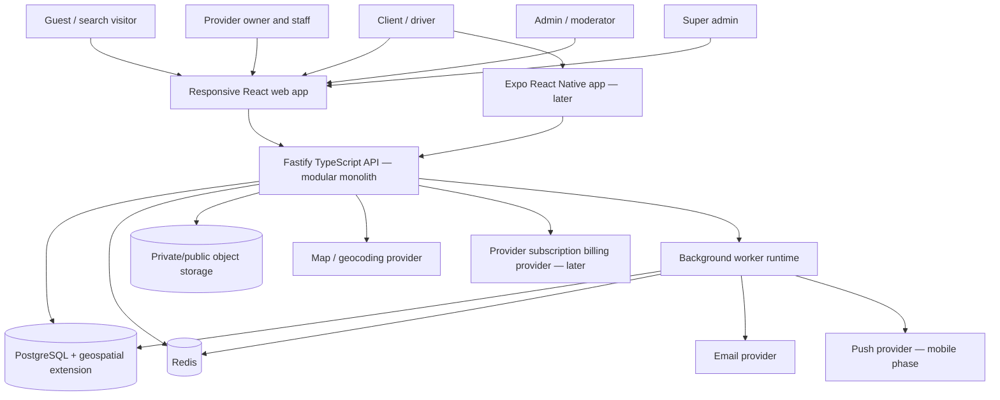

# AutoCare Hub — Architecture

> Status: target architecture with the first public discovery/profile slices
> implemented on `dev`; backend replacement and legacy deletion remain gated by
> replacement coverage and review
>
> Updated: 2026-08-14
>
> Applies to: web-first product, future iOS/Android clients
>
> Implementation roadmap: `PROJECT_PLAN.md`

Machine-readable companion maps:

- `docs/architecture/domain-model.yaml`;
- `docs/architecture/delivery-plan.yaml`;
- `docs/architecture/legacy-migration-map.yaml`.

## 1. Architectural position

AutoCare Hub evolves the copied legacy booking repository in place. It is a
modular monolith, not a greenfield FastAPI/Next.js rewrite.

Current baseline (the public AutoCare discovery/profile slices and the first
owner/client workspace slices are already running on `dev`):

- React 19 + TypeScript + Vite + React Router frontend;
- Redux Toolkit/RTK Query, MSW, Tailwind and Base UI primitives;
- Fastify + TypeScript backend;
- PostgreSQL + TypeORM migrations;
- Redis for distributed runtime concerns where required;
- JWT access tokens, refresh sessions, CSRF controls and RBAC;
- transactional outbox, email/notifications, uploads, audit, metrics and CI.

Target principle:

```text
reuse platform infrastructure
        +
replace cabinet-rental domain
        =
AutoCare Hub marketplace and provider SaaS
```

The backend remains the only owner of business rules and persistent product
data. Web and future mobile clients are API consumers. No client directly
accesses PostgreSQL or reconstructs authorization, price, entitlement, booking,
quote or bonus rules.

### Deployment capability profiles

Every deployment receives a validated `VITE_DEPLOYMENT_MARKET` profile at
build/deploy time. The initial values are `ru` and `global`; the registry can
later add country or market profiles without branching UI components. The
profile selects market-specific capabilities such as visible OAuth providers,
payment methods, legal links, currencies and feature copy. For example, the
`ru` profile hides Google sign-in when that provider is not approved, while
`global` exposes all providers enabled for the deployment.

This variable is public frontend configuration, not a secret and not an
authorization boundary. The API must publish or validate the effective
capability allow-list and reject unsupported OAuth/provider actions server-side.
Missing or unknown profiles fail closed to the restrictive policy, surface a
startup/configuration warning, and are covered by deployment smoke tests.

## 2. Non-negotiable rules

1. Use a versioned API (`/api/v1`) for all new AutoCare endpoints.
2. Keep one source of truth for web and mobile contracts.
3. Use TypeORM migrations for every schema change; never use schema sync in
   production.
4. Validate external input with Zod and enforce critical invariants in the
   database.
5. Every provider-scoped query includes provider/location authorization.
6. A service comparison is valid only across the same platform-controlled
   `ServiceDefinition` and compatible comparison schema.
7. Booking and accepted-quote records preserve immutable historical snapshots.
8. Money is stored in integer minor units plus ISO 4217 currency.
9. UTC instants are used for events; location timezone is stored and used for
   schedules/local dates.
10. Repair/service payments and provider subscription payments are different
    bounded contexts and must never share business state machines.
11. Provider-paid plan status must not silently manipulate organic ranking.
12. Messages and attachments are private by default; admin access is exceptional
    and audited.
13. Bonus value is provider-scoped and ledger-based, never a cross-provider
    cash wallet.
14. Redis, realtime transports and background workers improve delivery but do
    not replace PostgreSQL as the durable source of truth.
15. Native development cannot begin before the mobile-readiness gate in
    `PROJECT_PLAN.md` passes.
16. Legacy AutoCare Hub code is removed only after its AutoCare replacement and
    relevant tests exist.

## 3. System context



The current backend already supports split runtime ownership (`api`, `worker`,
or `all`). AutoCare modules should use the existing outbox and worker model for
durable email, notification, cleanup and billing jobs.

## 4. Bounded contexts

### 4.1 Identity and access

Responsibilities:

- users, credentials, OAuth identities and verified email;
- sessions, refresh-token rotation/revocation and account status;
- global platform roles: client, admin and super admin;
- provider memberships and scoped provider permissions;
- security events, rate limits, audit records and account deletion.

Important change from the legacy booking baseline:

`owner` should not be the long-term authorization boundary. A person may belong
to several providers or locations and have different permissions at each.
Provider access therefore uses `ProviderMembership`; global admin roles remain
on `User`.

Recommended transition:

- keep the existing `owner` enum only while legacy routes exist;
- create provider membership records for new AutoCare work;
- remove global owner assumptions after all protected routes use membership
  policies.

### 4.2 Catalog

Responsibilities:

- platform service categories;
- standardized service definitions;
- localized public names/descriptions;
- per-service comparison schema;
- catalog version/status and provider requests for missing services.

Canonical chain:

```text
ServiceCategory
      |
      v
ServiceDefinition
      |
      v
ServiceOffering (per location)
```

Providers cannot create arbitrary canonical services. They choose an approved
definition, then configure their offering. Missing-service requests go through
moderation.

### 4.3 Provider network

Responsibilities:

- provider legal/brand organization;
- one or more physical service locations;
- provider/location verification;
- memberships, invitations and permissions;
- hours, closures, facilities, contacts and public media.

`ServiceProvider` represents the business/brand. `ServiceLocation` represents
the physical place used for search, map distance, schedules and bookings.

### 4.4 Vehicles

Responsibilities:

- client garage;
- make/model/year/variant/engine/fuel metadata;
- optional VIN and registration data;
- offering compatibility and price overrides.

VIN is optional for basic browsing. Sensitive vehicle identifiers must not be
included in public APIs, analytics payloads or logs.

### 4.5 Discovery and comparison

Responsibilities:

- geospatial offering search;
- server-side filters/sorts and stable pagination;
- result projections for list and map;
- comparison eligibility and normalized rows;
- ranking inputs and data-quality indicators.

Search is offering-first, not provider-name-first:

```text
service definition + vehicle + location/radius + desired time
                               |
                               v
compatible active offerings at active verified locations
                               |
                               v
price/rating/distance/inclusions/availability comparison
```

### 4.6 Booking and scheduling

Responsibilities:

- location availability and blocked periods;
- instant and request-to-confirm booking modes;
- booking state transitions;
- idempotency and overlap prevention;
- reschedule/cancel/no-show policies;
- immutable commercial/service snapshot;
- completion events and review/bonus eligibility.

### 4.7 Unified chat, inquiry and quote

Responsibilities:

- provider questions before a booking and service-request conversation;
- owner-to-admin support and admin-to-super-admin escalation channels;
- one role-scoped chat workspace for web and future mobile clients;
- private media attachments;
- read/unread state;
- WebSocket delivery with REST as the source of truth and reconnect-safe
  refetch/polling fallback;
- versioned estimates/quotes;
- quote acceptance and booking conversion;
- reports and exceptional moderation access.

A chat is not a general social network. Each thread has an explicit type:
`service_request`, `provider_inquiry`, `support` or `admin_escalation`. A
provider inquiry may be created before a booking and can optionally reference a
service, vehicle or location. Access is granted only to the client/provider
members involved, the assigned support/admin roles, or the super-admin; knowing
an identifier is never sufficient. Messages and attachments are private by
default and every exceptional moderation access is audited.

The durable model is `AutoCareChatThread` plus `ServiceMessage` and
`ServiceAttachment`. Request threads keep the legacy request identifier for
backward-compatible reads while new records also store `thread_id`. The same
contract is available through `/api/v1/chats` and `/v1/chats/:chatId/ws`, so
web and native clients share lifecycle, read-marker, attachment and timestamp
semantics.

### 4.8 Reviews and reputation

Responsibilities:

- verified review eligibility from completed bookings;
- rating dimensions and aggregate calculation;
- edit/reply/report/moderation rules;
- anti-abuse and public projections.

The reviews context also produces a versioned `ProviderTrustSnapshot` for each
service location. It records the computed score, badge state, policy version,
input counters, reason codes, `computed_at` and `valid_until`. Inputs are limited
to attributable platform signals: completed interactions, sample-size-adjusted
verified ratings, complaint/dispute and cancellation rates, response and quote
reliability, price consistency, profile verification and moderation state.
Subscriptions, promo codes and paid placement are never score inputs. Badge
eligibility is threshold-based, expires on schedule, and can be suspended with
an auditable reason. Public cards and map markers expose the badge plus a
short explanation of the current policy version.

### 4.9 Provider bonuses

Responsibilities:

- provider-scoped program and rules;
- customer balance projection;
- immutable bonus ledger;
- earn/redeem/expire/adjust state transitions;
- booking integration and liability reporting.

This context is intentionally separate from subscription promo codes.

### 4.10 Provider subscriptions

Responsibilities:

- plan catalog and period prices;
- provider billing customer/subscription state;
- effective entitlements;
- super-admin manual grants;
- subscription promo codes/redemptions;
- billing provider events, reconciliation and incidents.

This context is activated after the free acquisition phase. Its schema may be
introduced earlier only when the associated rules and tests are approved.

### 4.11 Moderation and operations

Responsibilities:

- provider/catalog/review/report queues;
- audit records and support actions;
- security events and incidents;
- health, metrics, retention, backups and runbooks.

## 5. Core data model

The names below are target names. Exact TypeORM filenames and migration order
are implementation details, but the boundaries and invariants are architectural.

### 5.1 Identity/provider access

#### User

- `id`, `name`, `email`, `phone`, `status`, locale, avatar;
- global role for client/admin/super-admin behavior;
- existing authentication/session fields remain reusable.

#### ServiceProvider

- `id`, `owner_account_id` only if needed for initial bootstrap;
- legal name, display name, description, contacts;
- tax/registration metadata as required by launch market;
- status: `DRAFT`, `PENDING_REVIEW`, `ACTIVE`, `CHANGES_REQUESTED`,
  `SUSPENDED`, `REJECTED`;
- verification timestamps and moderation metadata.

#### ProviderMembership

- `provider_id`, `user_id` unique pair;
- role label: owner/manager/staff/accountant or display label;
- explicit permission set or role template;
- status, invited/accepted/revoked timestamps;
- optional allowed location IDs.

Critical rule: every provider mutation verifies active membership and the
specific permission; knowing a provider/location UUID is never sufficient.

#### ServiceLocation

- `provider_id`, name, description, address components;
- latitude/longitude/geography point and timezone;
- public contacts, facilities, policies and verification state;
- active/suspended status;
- aggregate rating fields as cached projections only.

### 5.2 Catalog and offerings

#### ServiceCategory

- stable code, localized labels, sort order, icon key and status.

#### ServiceDefinition

- category, stable code, localized labels/descriptions;
- default duration range and supported booking/price modes;
- `comparison_schema` version;
- status/version timestamps.

Comparison schema fields should use platform-defined stable keys, types, units,
labels and validation rules rather than arbitrary provider JSON.

#### ServiceOffering

- location and service-definition IDs;
- status and booking mode;
- price type: `FIXED`, `FROM`, `RANGE`, `QUOTE_REQUIRED`;
- `price_min_minor`, optional `price_max_minor`, currency;
- duration estimate/range;
- structured inclusions/exclusions/comparison values;
- warranty terms, provider description;
- version and timestamps.

Constraints:

- fixed price requires min and equal/absent max;
- range requires ordered min/max;
- quote-required must not pretend to have an exact comparable total;
- currency is consistent per offering and snapshot;
- only approved schema keys/values are accepted.

#### OfferingVehicleRule

- offering ID;
- make/model/year/engine/fuel filters or catalog vehicle reference;
- allow/deny behavior;
- optional price/duration override;
- priority/specificity and effective dates.

### 5.3 Scheduling and booking

#### LocationSchedule / ScheduleException / BlockedPeriod

Reuse the current schedule concepts, but key them by location and capacity
resource where required. Store local schedule values with the location timezone.

#### Booking

- customer, provider, location, offering/service definition and vehicle IDs;
- optional inquiry/accepted quote ID;
- start/end instants and location timezone snapshot;
- mode and state;
- idempotency key;
- cancellation/reschedule/completion metadata;
- immutable `service_snapshot`, `price_snapshot`, `vehicle_snapshot`,
  `provider_snapshot` and policy version.

Recommended states:

```text
REQUESTED -> CONFIRMED -> IN_PROGRESS -> COMPLETED
    |            |             |
    +------------+-------------+--> CANCELLED

REQUESTED -> DECLINED
CONFIRMED -> NO_SHOW
```

Allowed transitions are implemented in one policy/service and tested per actor.
State history is append-only.

Database concurrency:

- creation is idempotent per customer/idempotency key;
- capacity-1 slots use a PostgreSQL exclusion/locking strategy or equivalent
  transactional check that is safe under concurrent requests;
- provider capacity greater than one is modeled explicitly rather than allowing
  accidental overlaps.

### 5.4 Conversations, messages and quotes

#### ServiceInquiry

- customer, provider, location, service definition and optional vehicle;
- optional preferred time/location notes;
- status: `OPEN`, `WAITING_PROVIDER`, `WAITING_CUSTOMER`, `QUOTED`,
  `BOOKED`, `CLOSED`, `REPORTED`;
- created/last-message/closed timestamps.

One inquiry owns one primary conversation. A provider cannot add unrelated
customers and a customer cannot add unrelated providers.

#### ConversationParticipant

- conversation/user IDs;
- participant type and provider membership reference where relevant;
- joined/left/read timestamps.

#### Message

- conversation ID, sender ID and client-generated idempotency key;
- kind: text/system/quote-event/attachment;
- sanitized text, created/edited/deleted timestamps;
- sequence/cursor for stable ordering.

Messages are not hard-deleted during normal use; user-visible deletion is a
tombstone unless legal retention requires physical deletion.

#### MessageAttachment

- message/inquiry/uploader IDs;
- private storage key, media type, bytes, dimensions and checksum;
- processing/scan status, retention class and timestamps;
- no raw client filename in public projection unless sanitized.

Access uses short-lived authorized URLs or an authenticated download endpoint.
Provider media galleries may be public; customer damage photos are not.

#### Quote / QuoteItem

- inquiry and provider/location IDs;
- monotonically increasing version;
- status: `DRAFT`, `SENT`, `ACCEPTED`, `DECLINED`, `EXPIRED`, `REVOKED`;
- currency, price type, min/max/total minor units;
- line items, inclusions, exclusions, parts/labour/tax flags;
- expected duration, warranty, notes and expiry;
- immutable sent snapshot.

Only the latest valid sent version may be accepted. Acceptance is idempotent and
transactionally links or creates the booking.

### 5.5 Reviews

#### Review

- one active review per eligible booking;
- customer, provider, location and service definition IDs;
- overall rating and optional approved dimensions;
- text, status, edit timestamps and provider reply;
- moderation/report metadata.

Aggregate ratings are recomputed transactionally or by durable background job.
Public APIs expose count and distribution so the UI does not overstate small
samples.

### 5.6 Bonuses

#### BonusProgram

- provider ID; optional location restrictions;
- active dates/status;
- approved unit/type and customer-facing rules;
- earn/redeem/expiry settings and policy version.

#### BonusAccount

- provider/customer unique pair;
- cached available/pending balance and version.

#### BonusTransaction

- account, booking and optional actor IDs;
- type: `EARN`, `REDEEM`, `REVERSAL`, `EXPIRE`, `ADJUSTMENT`;
- signed amount in bonus minor units/points;
- idempotency key, reason, source transaction and timestamps;
- immutable after creation.

The ledger is authoritative; cached balances are projections updated in the same
transaction or rebuilt from the ledger. Reversals reference original entries.

### 5.7 Provider subscriptions and promo codes

#### SubscriptionPlan / PlanPrice

- stable plan code, status, display metadata and entitlement template;
- currency, amount minor, `period_months`, effective dates;
- provider billing product/price IDs stored as integration metadata.

#### ProviderSubscription

- provider, plan/price and billing customer IDs;
- status: `PENDING`, `TRIALING`, `ACTIVE`, `PAST_DUE`, `GRACE`,
  `CANCELLED`, `EXPIRED`;
- period start/end and cancel/renew metadata;
- provider event IDs and reconciliation timestamps.

#### EntitlementGrant

- provider, feature/limit, valid-from/until;
- source: `FREE_BASELINE`, `SUBSCRIPTION`, `SUPER_ADMIN_GRANT`,
  `FOUNDING_PARTNER`, `SUPPORT_ADJUSTMENT`;
- reason, creator, revoke metadata and audit correlation.

Effective entitlements are derived deterministically. Manual grants do not
rewrite billing history and billing cancellation does not erase a separate
valid super-admin grant.

#### SubscriptionPromoCode

- normalized unique code hash/display form;
- status and validity window;
- discount type `PERCENT` or `FIXED`;
- value/currency, eligible plan/period/country rules;
- global and per-provider redemption limits;
- optional first-purchase-only rule;
- creator/revoker and audit metadata.

#### PromoRedemption

- promo, provider, subscription/checkout IDs;
- immutable discount snapshot and timestamps;
- unique keys that prevent duplicate redemption under retries.

Subscription discounts are not customer loyalty bonuses and must not share
tables, balances or user-facing terminology.

## 6. Search and comparison architecture

### 6.1 Geospatial storage

Preferred direction is PostgreSQL with PostGIS:

- location position stored as `geography(Point, 4326)`;
- GiST index for radius queries;
- bounding/radius filter in SQL before expensive availability projection;
- distance returned by the query, not recomputed independently in the client.

If the deployment platform cannot support PostGIS, an ADR must choose an
alternative. Do not approximate production radius search using city strings.

### 6.2 Search endpoint projection

A new endpoint should return only fields needed for result cards/map markers:

- stable offering/location IDs;
- service definition and compatible vehicle summary;
- price type/min/max/currency and comparison flags;
- normalized inclusions and warranty summary;
- rating/count, distance and next availability;
- verification/data-quality badges backed by policy;
- map coordinates with appropriate precision;
- cursor and applied-query metadata.

List and map are two views of the same response/query. The UI must not make a
second unbounded map request that represents a different result universe.

### 6.3 Comparison eligibility

The server returns a `comparison_key` derived from:

- service definition/version;
- required comparison schema version;
- vehicle/compatibility context;
- currency/market rules where applicable.

The client may compare only items with compatible keys. It may display
non-exact prices, but fixed/from/range/quote values are visually and semantically
distinct. Missing inclusions remain “not specified,” never inferred as false or
included.

### 6.4 Ranking

Initial recommended ranking should be deterministic and observable, using
approved inputs such as:

- relevance/vehicle compatibility;
- distance;
- price completeness/comparability;
- verified rating with sample-size handling;
- next availability;
- provider response/booking reliability;
- data freshness.

The trust score is one bounded quality input among comparable offers; it may
improve ordering when service, vehicle and location relevance are otherwise
comparable, but cannot make an incompatible or materially worse match appear
first. Ranking explanations must identify the main factors. Quality snapshots
are recomputed from durable events and retain an audit trail so badge and rank
changes can be investigated. A sponsored result, if introduced, is a separate
labelled slot and never masquerades as organic trust.

Any sponsored placement is a separate labeled product. Subscription plan alone
must not modify organic ranking.

### 6.5 Scaling path

PostgreSQL remains sufficient for initial city/region scale. Introduce a search
engine only after measurements show SQL/index limits or require advanced text,
faceting or geographic ranking. PostgreSQL remains the source of truth; an
external search index is a rebuildable projection populated through durable
events.

## 7. API architecture

### 7.1 Contract

- Base: `/api/v1` for new AutoCare endpoints.
- JSON resource naming and stable enum codes.
- Zod request/response schemas and OpenAPI parity.
- Generated or validated shared TypeScript API client/types.
- Cursor pagination for unbounded collections.
- `Idempotency-Key` for booking, message, quote acceptance, bonus redemption and
  billing checkout mutations.
- Correlation/request ID on responses and logs.
- Consistent structured errors with stable codes and localized UI mapping.

Example error:

```json
{
  "error": {
    "code": "QUOTE_EXPIRED",
    "message": "The quote can no longer be accepted.",
    "requestId": "req_...",
    "details": {}
  }
}
```

Clients do not branch on translated message text.

### 7.2 Draft resource surface

```text
GET    /api/v1/catalog/categories
GET    /api/v1/catalog/services
GET    /api/v1/vehicle-catalog?brandId={brandId}

GET    /api/v1/search/offerings
GET    /api/v1/providers/:providerId
GET    /api/v1/locations/:locationId
GET    /api/v1/locations/:locationId/offerings

GET    /api/v1/me/vehicles
POST   /api/v1/me/vehicles
PATCH  /api/v1/me/vehicles/:vehicleId
DELETE /api/v1/me/vehicles/:vehicleId

GET    /api/v1/me/bookings
POST   /api/v1/bookings
GET    /api/v1/bookings/:bookingId
POST   /api/v1/bookings/:bookingId/transitions

GET    /api/v1/me/inquiries
POST   /api/v1/inquiries
GET    /api/v1/inquiries/:inquiryId
GET    /api/v1/inquiries/:inquiryId/messages
POST   /api/v1/inquiries/:inquiryId/messages
POST   /api/v1/inquiries/:inquiryId/attachments
POST   /api/v1/quotes/:quoteId/accept
POST   /api/v1/quotes/:quoteId/decline

GET    /api/v1/me/bonus-accounts
GET    /api/v1/me/bonus-accounts/:accountId/transactions

GET    /api/v1/provider-workspace/providers
... provider locations, offerings, schedule, inquiries, quotes and bookings

GET    /api/v1/admin/catalog/...
GET    /api/v1/admin/provider-applications/...
GET    /api/v1/super-admin/subscription-plans
POST   /api/v1/super-admin/entitlement-grants
POST   /api/v1/super-admin/promo-codes
```

Exact routes are finalized per vertical slice and added to OpenAPI with
authorization/negative tests.

### 7.3 Web authentication

Reuse the current short-lived access token and rotating refresh-session model,
including CSRF protection for cookie-authenticated mutations, origin checks,
session revocation and security events.

### 7.4 Mobile authentication

Mobile must not imitate browser cookie storage blindly. Before native work:

- define OAuth Authorization Code + PKCE/deep-link flows;
- keep short-lived access credentials in memory where possible;
- keep refresh credentials only in iOS Keychain/Android Keystore-backed secure
  storage;
- bind refresh sessions to server records and support remote revocation;
- use rotation/reuse detection and device/session naming;
- ensure media download and upload authorization works with bearer auth.

The same identity/session domain may support both transports, but threat models
and credential storage differ.

## 8. Backend module structure

Keep the existing modular-monolith style and migrate toward explicit domain
modules:

```text
server/src/
├── config/
├── database/
│   └── migrations/
├── entities/                 # TypeORM persistence entities
├── modules/
│   ├── auth/
│   ├── users/
│   ├── providers/
│   ├── catalog/
│   ├── vehicles/
│   ├── offerings/
│   ├── search/
│   ├── schedules/
│   ├── bookings/
│   ├── inquiries/
│   ├── messaging/
│   ├── quotes/
│   ├── reviews/
│   ├── bonuses/
│   ├── subscriptions/        # activated later
│   ├── notifications/
│   └── admin/
├── shared/
│   ├── auth/
│   ├── errors/
│   ├── http/
│   ├── mail/
│   ├── observability/
│   ├── redis/
│   ├── security/
│   ├── storage/
│   └── validation/
└── routes/
```

Layer responsibilities inside a module:

- route/controller: authentication context, parsing, response mapping;
- schema: Zod inputs/outputs;
- service/policy: business transitions and authorization decisions;
- repository/query service: data access and transaction boundaries;
- mapper: persistence-to-contract projection;
- tests: pure policy, integration, migration and route-level negative paths.

Avoid generic repository frameworks. Use direct TypeORM queries for simple
CRUD and focused repositories/query services for complex search, authorization,
locking and ledger operations.

## 9. Frontend architecture

Preserve the current Feature-Sliced-inspired boundaries:

```text
src/
├── app/       # bootstrap, routing, store, layouts, mocks
├── pages/     # route composition
├── widgets/   # large page sections/shells
├── features/  # user actions and workflows
├── entities/  # typed domain projections and entity UI
├── shared/    # API/config/contracts/lib/UI
└── components/ui/
```

New naming should use provider/location/offering rather than extending cabinet
terminology. During migration, legacy and AutoCare slices may coexist, but new
AutoCare pages cannot import legacy cabinet entity contracts.

Server state remains in RTK Query. Local state is limited to ephemeral UI state
and drafts. Search filters live in URL/query state so pages are shareable and
back/forward navigation is correct.

### 9.1 Web rendering and SEO

The current app is a Vite SPA. That is compatible with the first authenticated
application and product pilot, but public discovery pages need an explicit SEO
decision.

Options to evaluate in an ADR after routes/data stabilize:

1. prerender selected public landing/category/city/location routes;
2. adopt React Router server/framework rendering within the React stack;
3. move only the public discovery surface to an SSR frontend while keeping the
   provider/admin app as the current SPA.

A wholesale Next.js rewrite is not the default. The chosen option must preserve
the Fastify API boundary and be justified by crawl/indexing measurements.

### 9.2 Design system

Before production visual changes, define tokens and state contracts for:

- brand/navigation/surfaces/text/accent/status/map colors;
- typography for marketing, dense data and controls;
- spacing, radius, shadow, breakpoints and focus rings;
- buttons, inputs, filters, cards, comparison rows, tables, maps, dialogs,
  drawers, chat bubbles, attachments, quote totals and ledger rows;
- loading, empty, error, stale, offline and permission states;
- light/dark behavior if dark mode remains in scope.

The supplied images are references for information architecture. They are not
evidence that every visible claim, partner logo, discount, date, payment flow or
desktop density is approved.

## 10. Messaging and realtime delivery

PostgreSQL is the message source of truth.

Initial reliable flow (implemented for AutoCare service requests):

1. client sends a message or offer via REST;
2. server authenticates participant and commits message;
3. transaction records outbox notification event;
4. response returns the durable message/offer projection;
5. recipient refreshes through polling and WebSocket invalidation events.

Realtime delivery:

- WebSocket pushes message, attachment, read-marker and offer invalidations;
- Redis pub/sub may fan out across API instances;
- reconnect always resumes from a durable cursor;
- missed realtime events never lose messages;
- mobile background delivery uses push notifications, not a permanently open
  socket assumption.

Typing indicators and presence are ephemeral and post-MVP. Do not persist or
overengineer them before core delivery/read status is reliable.

## 11. Media and storage

Storage classes:

- public: approved provider/location galleries and logos;
- private: customer vehicles, damage photos, message/quote attachments,
  verification documents;
- internal: security/export artifacts with restricted access.

Upload sequence:

1. authorize actor and target resource;
2. bound content length/count before processing;
3. decode and validate MIME/signature/dimensions;
4. reject animated/unsafe/oversized content;
5. re-encode images without metadata;
6. store with generated key, never trusted filename;
7. persist attachment manifest/checksum/state;
8. return authorized projection;
9. clean orphaned/expired objects through a durable job.

Exact image limits are a product/performance decision. Existing cabinet upload
code provides reusable validation patterns but should be generalized rather
than copied with public cabinet paths.

Malware scanning becomes mandatory before non-image documents are accepted.
Provider verification documents should not be introduced through the public
gallery upload flow.

## 12. Notifications and background jobs

Use the current transactional outbox for:

- auth/security email;
- booking/inquiry/quote state changes;
- unread-message notifications;
- booking reminders;
- review/moderation updates;
- bonus earn/expiry notifications;
- subscription/grace/expiry notifications;
- analytics/search projection updates if later required.

Jobs must be idempotent, bounded, retryable and observable. Dead-letter events
require an operator workflow. In-process timers are acceptable only to wake the
worker; PostgreSQL/outbox state determines what work exists.

## 13. Security and privacy

### Authentication and authorization

- reuse current password hashing, session rotation/revocation and OAuth safety;
- retain email verification, password reset and breach-check policies;
- require global role plus resource membership/permission where applicable;
- test IDOR across provider, location, vehicle, inquiry, message, quote,
  booking, bonus and subscription resources;
- use stronger confirmation/re-authentication for critical super-admin actions.

### Messaging/privacy

- encrypt all traffic in transit;
- private attachments are never exposed by guessable static URLs;
- logs, metrics and analytics exclude message bodies, quote private notes, VIN,
  registration numbers and attachment contents;
- exceptional moderator/support conversation access records actor, reason,
  scope and time;
- retention/delete/export rules cover messages and media explicitly;
- reporting preserves evidence without giving routine broad access.

### Promo/subscription abuse

- promo codes are normalized and compared safely;
- redemption is atomic and rate-limited;
- eligibility and usage limits are checked server-side;
- grants, revocations, plan edits and promo edits are audited;
- billing webhooks are signature-verified, idempotent and reconciled;
- provider access changes follow effective entitlement policy, not frontend
  flags.

### Bonuses

- all writes are transactional ledger entries;
- manual adjustment requires permission, reason and audit;
- no client-supplied balance or earned amount is trusted;
- completion/cancellation/reversal handlers are idempotent;
- balances cannot become negative unless an explicitly approved debt policy is
  introduced.

## 14. Observability and analytics

Reuse the current bounded metrics, request IDs, readiness checks and structured
logging. Add AutoCare-specific metrics without high-cardinality labels:

- search requests/result counts/latency/no-result rate;
- provider/location/offer data freshness;
- inquiry response time and message delivery lag;
- quote sent/accepted/expired conversion;
- booking requested/confirmed/completed/cancelled/no-show;
- notification/outbox backlog;
- bonus ledger failures and balance reconciliation;
- subscription webhook/reconciliation/entitlement outcomes;
- upload rejection/processing/orphan cleanup.

Product analytics events use pseudonymous IDs and an approved consent/privacy
policy. Raw message text, attachment metadata, full addresses, VIN and emails
are not analytics properties.

## 15. Testing strategy

### Unit tests

- price/comparison normalization;
- vehicle rule precedence;
- booking/quote state machines;
- permission and entitlement policies;
- promo eligibility/discount snapshots;
- bonus earning/redemption/reversal;
- notification and retention policies.

### PostgreSQL integration tests

- migrations and constraints;
- PostGIS radius/distance ordering;
- provider-scoped authorization queries;
- booking overlap/idempotency;
- message cursor ordering/idempotency;
- quote acceptance transaction;
- bonus double-spend prevention;
- promo redemption concurrency;
- entitlement precedence and billing reconciliation.

### Contract tests

- Zod/OpenAPI/RTK Query/MSW parity;
- stable error codes/enums;
- cursor behavior;
- backward compatibility for released `/api/v1` fields.

### Browser E2E

- guest search/compare;
- client vehicle -> booking;
- client inquiry -> photo -> quote -> booking;
- provider onboarding/offer/inbox/booking;
- review and bonus history;
- admin moderation;
- super-admin grant/promo flows after billing phase;
- responsive mobile-web and offline/retry cases.

### Native tests — later

- generated client compatibility;
- secure auth/session revocation;
- deep links and push routing;
- photo permissions/upload recovery;
- representative iOS/Android accessibility/device matrix.

## 16. Migration strategy from the legacy booking baseline

### Step A — Freeze and inventory

- keep current main buildable;
- mark old cabinet/commission docs as legacy;
- identify reusable shared/auth/operations modules;
- establish new AutoCare routes/entities beside legacy ones.

### Step B — New domain in a fresh AutoCare schema/database

Recommended if no legacy customer data must be retained:

- keep migration history in the copied repository for traceability while
  defining a reviewed AutoCare baseline/reset strategy;
- start AutoCare deployments with a clean database;
- never run destructive cabinet cleanup against an unknown production database;
- keep rollback artifacts until the new domain is accepted.

If legacy data must be retained, stop and write a mapping/backfill ADR before
changing schema.

### Step C — Vertical replacement

Recommended order:

1. provider/location/catalog/offering;
2. search/compare/profile;
3. vehicle/booking/review;
4. inquiry/message/quote/media;
5. provider/admin workflows;
6. bonuses;
7. subscriptions;
8. native clients.

Each replacement includes real API, frontend/mock contract, tests and docs.

### Step D — Legacy removal

Only after replacement gates pass:

- remove cabinet routes/entities/pages/mocks/translations/assets;
- remove customer booking payment, commission and Stripe Connect code;
- preserve/generalize only subscription-relevant payment reliability helpers;
- verify migrations, OpenAPI, lint, unit/integration/E2E and production build;
- list deleted files and data consequences for user review.

No bulk deletion is an exploratory step. Resolve exact paths, inspect them and
delete only as part of a reviewed migration slice inside the AutoCare Hub
workspace.

## 17. Deployment path

### Development

- frontend mock mode for approved UI work;
- real mode with local PostgreSQL/Redis for vertical slices;
- deterministic AutoCare seed/reset scripts scoped to known fixture IDs.

### Staging

- production-like PostgreSQL with geospatial support;
- private/public object storage and real map provider;
- worker runtime, Redis, SMTP and observability;
- fake/test subscription provider only after billing phase;
- realistic but non-personal seeded data.

### Production

- independently deployable frontend, API and worker processes;
- managed PostgreSQL, Redis and object storage;
- release migration step before API rollout;
- health/readiness probes and private metrics;
- backups, point-in-time recovery where available, restore rehearsal;
- secrets in platform secret storage;
- gradual rollout and documented rollback.

The current Vercel/Render legacy deployment is not automatically the target
AutoCare deployment. New domain, repository, environment names, cookies,
origins, storage paths, email sender, OAuth clients, map keys and billing keys
must be configured independently.

## 18. Architecture decisions still open

Create/approve ADRs for:

1. launch market, currency, locales and legal/privacy rules;
2. fresh AutoCare database versus legacy data migration;
3. geospatial provider/PostGIS availability;
4. service catalog v1 and comparison schemas;
5. booking modes and state policies;
6. provider verification and team permission model;
7. bonus unit/expiry/reversal rules;
8. conversation access/retention and attachment limits;
9. SPA prerender versus React SSR strategy for public SEO;
10. subscription plans/periods/free tier/grace behavior;
11. billing provider based on launch legal entity/country;
12. mobile auth, push and deep-link strategy.

Until an ADR is approved, code should isolate the choice behind a narrow policy
or configuration boundary and must not invent irreversible rules.
