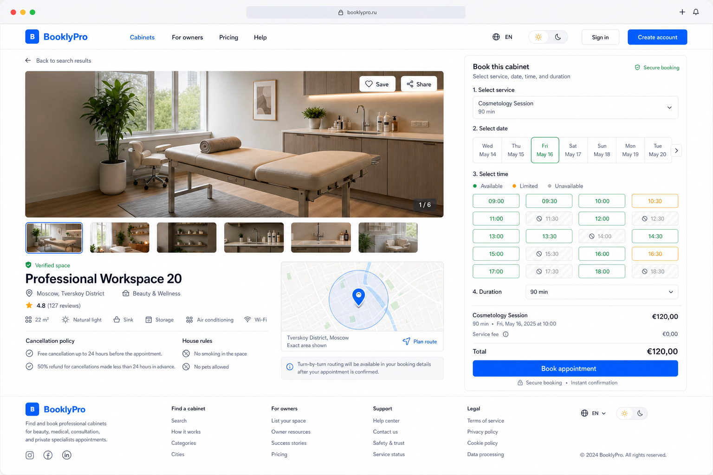
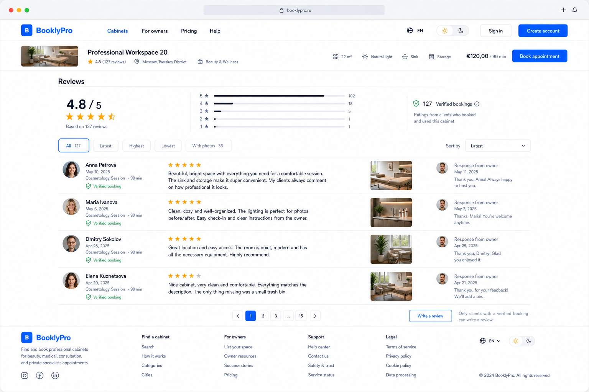
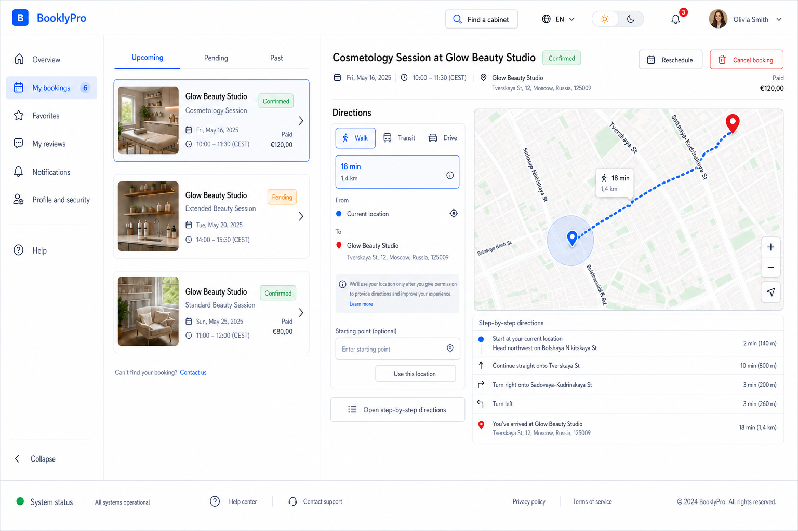
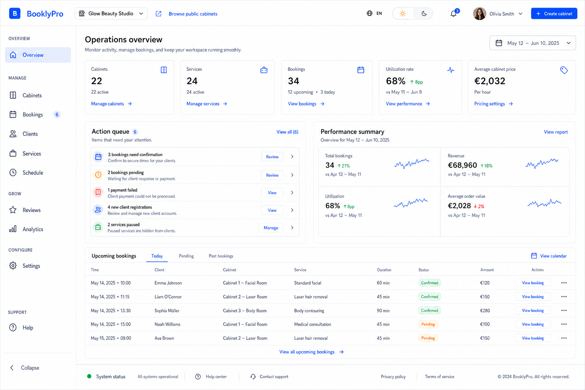
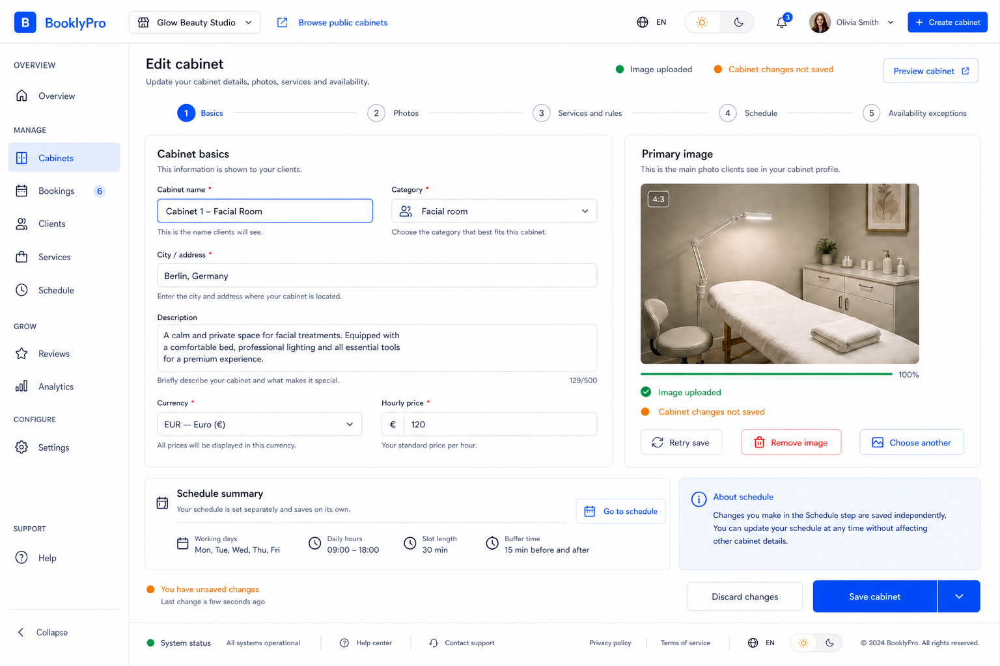
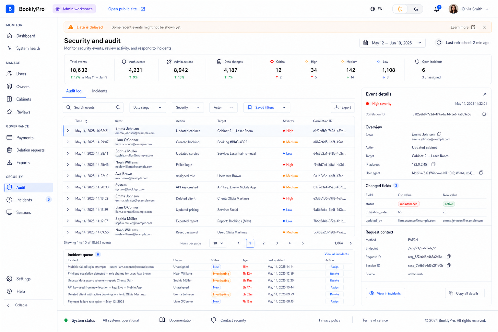

# AutoCare Hub desktop proposal suite, revision 2

Date: 2026-08-01

Status: awaiting desktop approval. This revision supersedes the first proposal
set for desktop composition only. Tablet and PWA/mobile proposals are deferred
until the desktop system is approved.

## User-requested changes

- Keep a stable header and useful footer on desktop and tablet.
- Preserve the visible light/dark theme switcher.
- Add a synchronized cabinet list and map to public discovery.
- Add privacy-aware directions from the client's chosen starting point to a
  confirmed booking.
- Keep reviews on the cabinet page rather than hiding them in a modal.
- Use hybrid authenticated navigation: global header plus scalable role sidebar.
- Approve desktop first, then tablet, then PWA/mobile.
- Generate three to five homepage desktop directions only after the remaining
  desktop pages are approved.

## Navigation contract

Public routes use a horizontal header because their stable destinations are
limited: Cabinets, For owners, Pricing, and Help. Language, theme, and account
actions stay at the right edge.

Authenticated routes use a global header for brand, workspace/account context,
public-site access, language, theme, notifications, and profile. Client, owner,
and admin destinations live in a persistent grouped sidebar with a collapse
control. This prevents header overflow as role functionality grows.

Desktop uses the expanded sidebar. Tablet will use a collapsible rail/drawer.
PWA/mobile navigation will be designed only after tablet approval.

## Desktop proposals

### Public catalog with map

The list and map are synchronized. Selecting a result selects its pin; selecting
a pin opens the same cabinet summary. Filters, map/list mode, current-location
action, header, theme control, and footer remain visible.

### Cabinet detail and booking

The upper cabinet page keeps inspectable media, rules, location, availability,
price, and booking together. The location control does not request permission
until the client chooses Plan route.

### Cabinet reviews on the same page

Reviews remain below the cabinet details on the same route. The rating link in
the summary scrolls to this section. The section includes distribution,
verified-booking status, filters, owner responses, pagination, and eligibility
for writing a review. It is not a modal.

### Client bookings and directions

The account sidebar contains growing client navigation. The selected confirmed
booking provides walking, transit, and driving modes, a route and steps, an
explicit location-permission explanation, and a manual starting-point fallback.

### Owner dashboard

The global header holds workspace context and account controls. The grouped
owner sidebar holds operational navigation and can grow without compressing the
header. The main surface preserves actions, metrics, performance, and bookings.

### Owner cabinet editor

The editor remains inside the owner workspace. Cabinet data, image state, and
independent schedule saving stay explicit while the sidebar preserves context.

### Admin audit workspace

The grouped admin sidebar separates monitoring, management, governance, and
security. Audit rows, structured details, stale data, and incident actions keep
the rest of the desktop width.

## Map and directions boundaries

- Map provider selection is an implementation decision and must include cost,
  regional coverage, accessibility, localization, geocoding, and route modes.
- Exact client location is requested only after an explicit action and is not
  persisted by default, used for profiling, or added to analytics payloads.
- A denied or unavailable permission has a manual starting-point fallback.
- Provider keys require origin/app restrictions, least privilege, quotas, and
  monitoring. Secret-capable provider calls stay behind the backend.
- Map loading, provider error, no route, offline, stale booking, changed address,
  and permission-denied states require clear recovery paths.
- Public cabinet coordinates must match the approved address and avoid exposing
  any unpublished private owner location.

## Approval state

Design confirmation 1 of 3 remains recorded. These revised images are proposal
evidence for desktop scope confirmation 2. They do not authorize visual code or
map-provider implementation.
