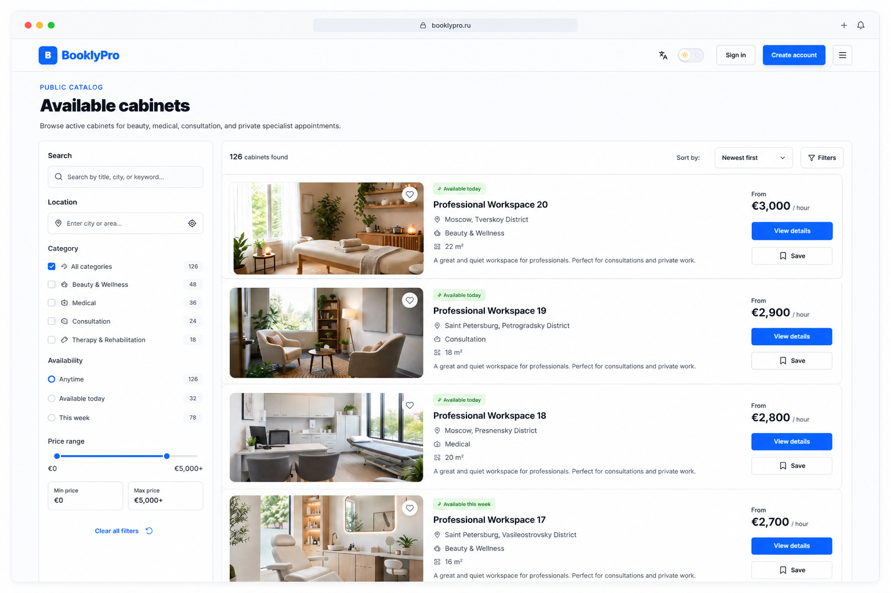
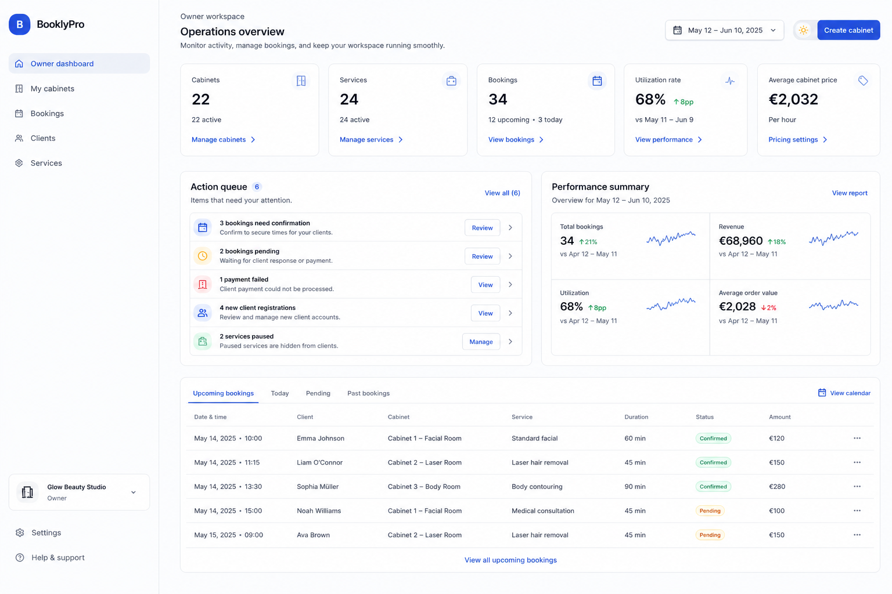
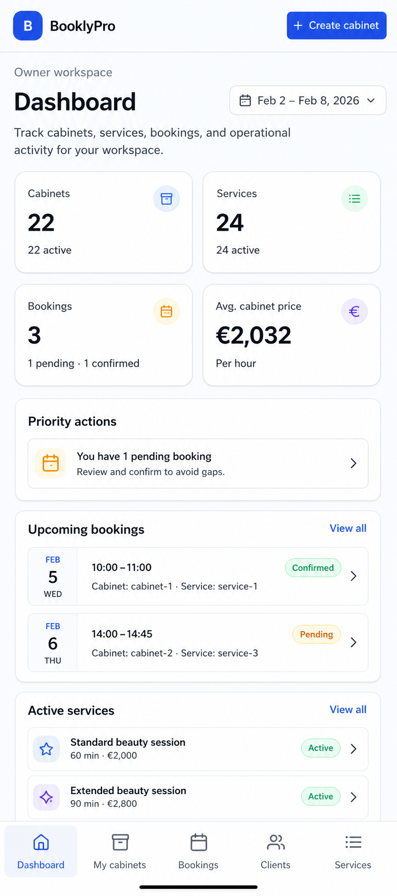
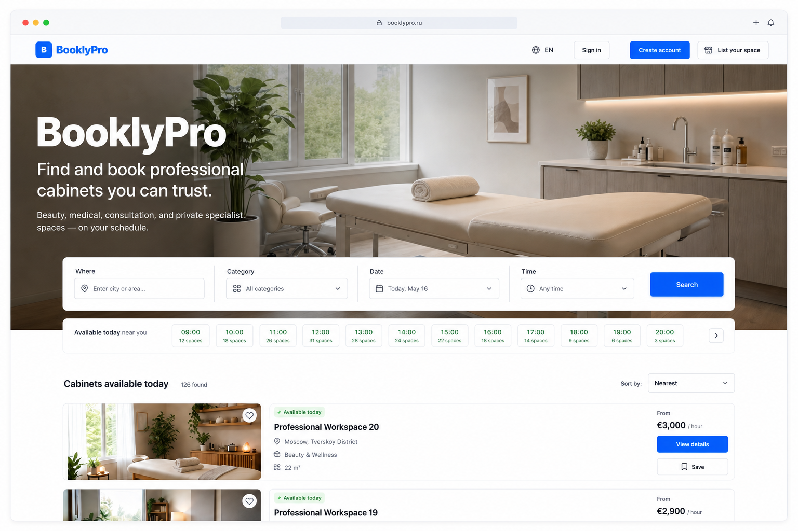
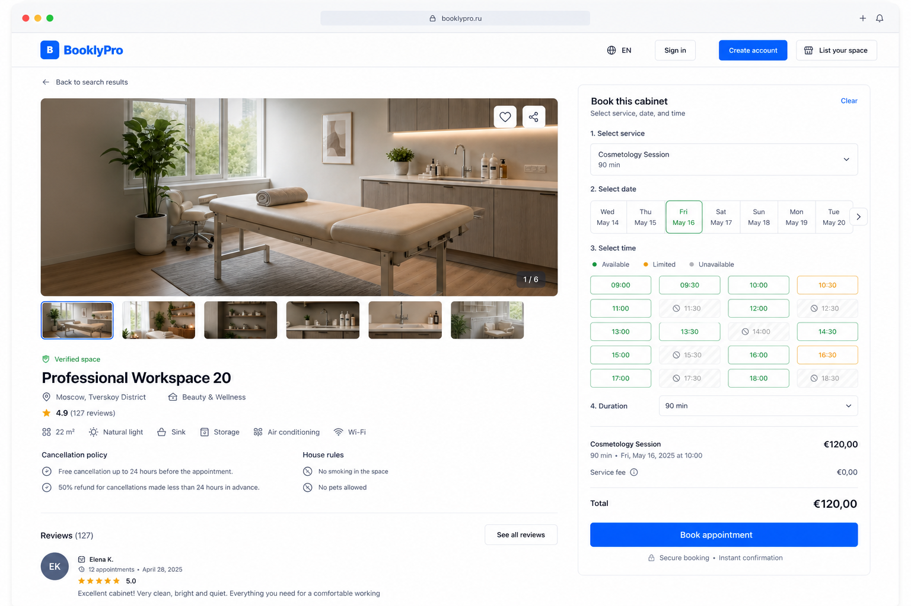
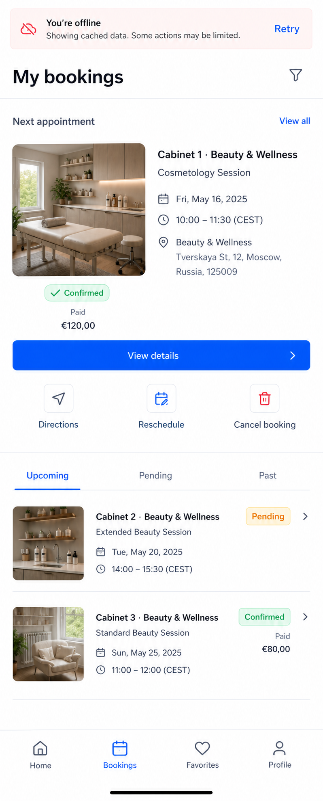
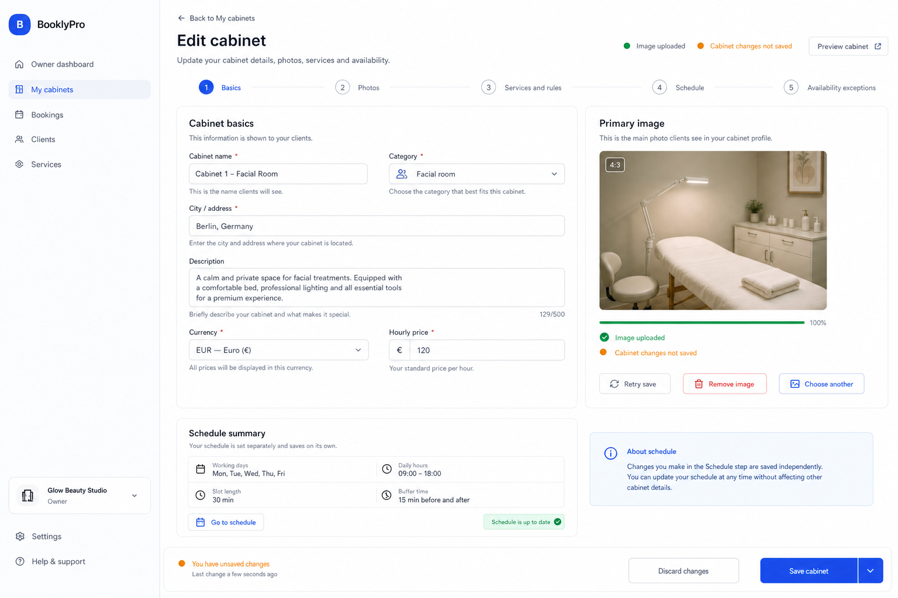
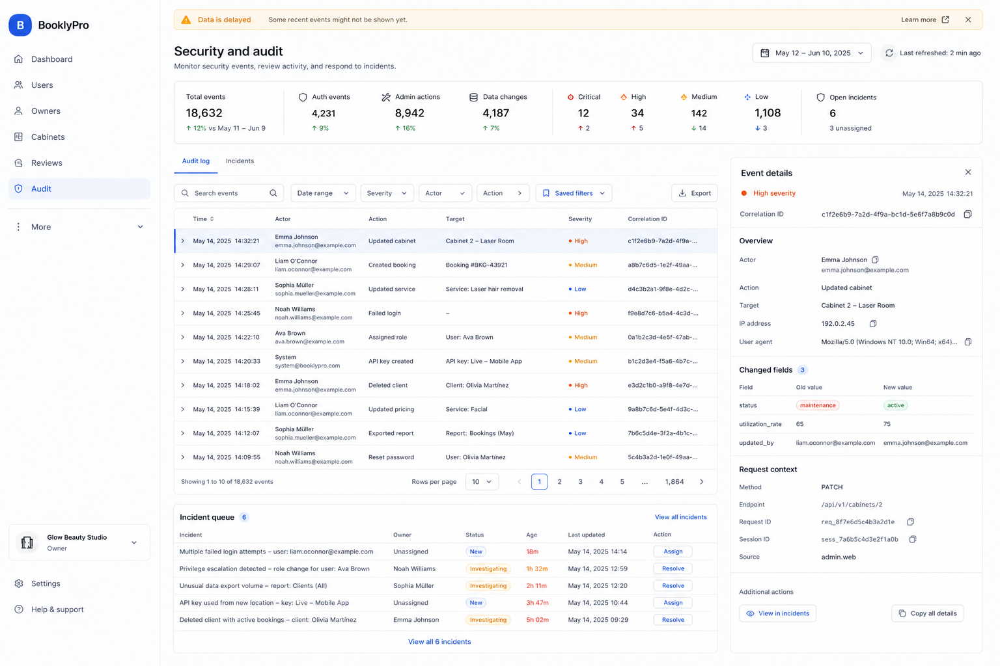

# AutoCare Hub visual proposal suite

Date: 2026-08-01

Status: proposal evidence. No visual implementation is authorized by these
images alone.

## Direction

AutoCare Hub should feel like a calm operational booking product rather than a
generic card gallery. The public experience is availability-first: a client
can understand where, when, and for what service a cabinet is available before
opening the booking flow. Owner and admin surfaces use flatter, denser rows and
action queues so urgent work is visible without scanning decorative panels.

Primary audience and jobs:

- Guests and clients find an inspectable cabinet, compare availability, and
  complete or recover a booking.
- Owners manage cabinets, schedules, images, services, and booking exceptions.
- Admins investigate security and operational events and resolve incidents.

Visual signature: availability is a navigation axis shared by the homepage,
catalog, cabinet detail, booking, and operational summaries. It is never
communicated by color alone.

System boundaries:

- AutoCare Hub blue is reserved for navigation, focus, and primary actions.
- Green, amber, and red communicate semantic status with text or icons.
- Public imagery must show the actual cabinet in stable 4:3 frames.
- Operational surfaces use 8-12 px radii and avoid nested cards and glass blur.
- All screens require light/dark, RU/EN/RO, keyboard, 200% zoom, reduced-motion,
  loading, empty, error, stale, offline, and permission-denied review.
- The production fake-browser shell remains unchanged until the penultimate
  release action.

## Approved proposals

The user approved this first proposal set on 2026-08-01. This records design
confirmation 1 of 3; it does not authorize implementation.

### Public catalog

The filter rail, availability metadata, cabinet facts, price, and primary
detail action support faster comparison without hiding inspectable imagery.

### Owner dashboard, desktop

The action queue, actionable metrics, compact performance summary, and booking
table replace weak empty space and repetitive nested cards.

### Owner dashboard, mobile

The mobile composition prioritizes owner actions and uses a correctly named
Dashboard destination with safe-area-aware primary navigation.

## Proposals awaiting approval

### Homepage

The first viewport is the real booking experience: an inspectable cabinet,
city/category/date/time search, an availability rail, and visible results.

### Cabinet detail and booking

The cabinet, rules, service, availability, total price, and primary booking
action remain understandable in one task-focused desktop viewport.

### Client bookings, mobile

The next appointment is primary, recovery actions are explicit, cached data
remains visible offline, and client navigation is limited to four destinations.

### Owner cabinet editor

Cabinet data, images, services/rules, schedule, and exceptions are separated.
Partial upload success and independent schedule saving are visible in context.

### Admin audit workspace

Dense event rows, structured details, stale-data disclosure, and an incident
queue replace raw metadata and wide mobile-hostile tables.

## Acceptance criteria

- No horizontal overflow or fixed-navigation overlap at 320-1440 px.
- Long RU/EN/RO labels, localized dates, currencies, and timezones remain clear.
- Every control has default, hover, focus, pressed, disabled, loading, and
  validation behavior; status is not encoded by color alone.
- Loading, empty, error, stale, offline, permission, and partial-success states
  preserve useful context and offer an honest recovery action.
- Cabinet images have stable dimensions, decode-aware placeholders, and an
  original-image fallback without layout shift.
- Visual baselines, axe, keyboard, touch, 200% zoom, and reduced-motion checks
  pass before any approved slice is considered complete.

Classification: visual-composition work. Three separate explicit confirmations
are required before frontend implementation begins.
