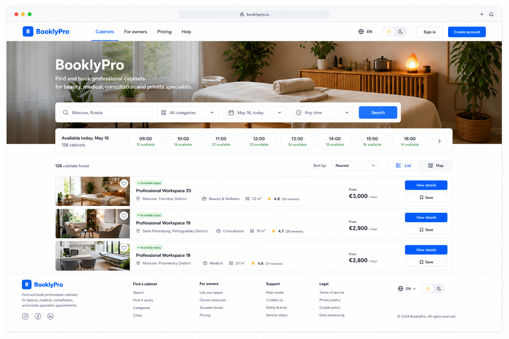
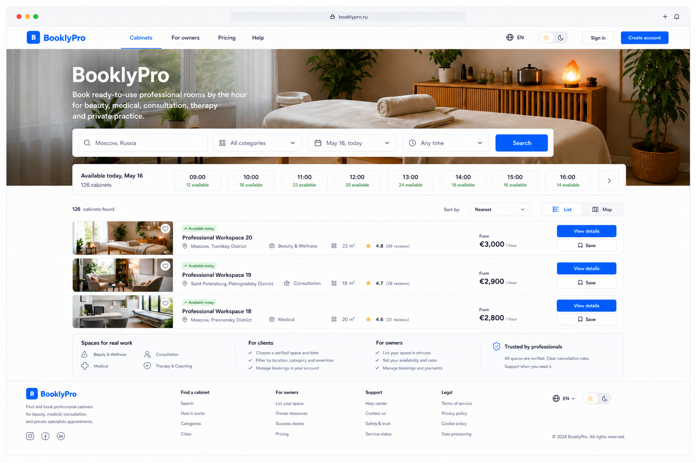
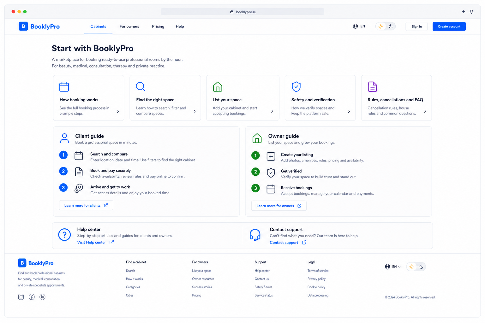
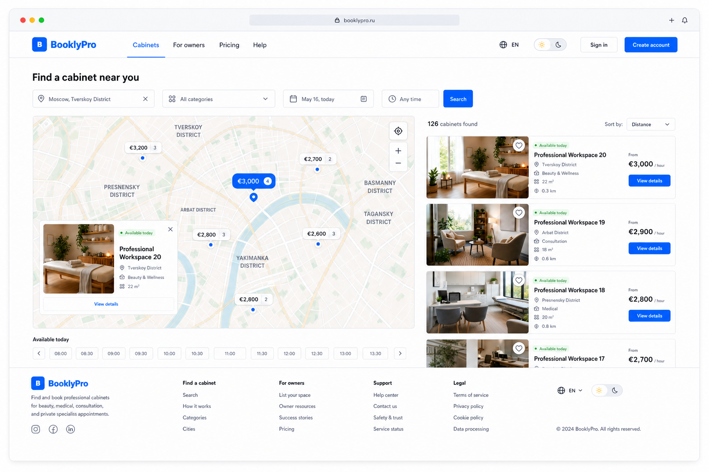
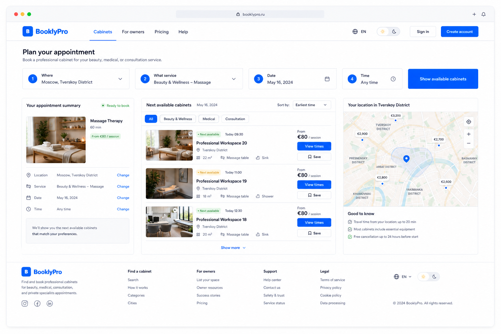
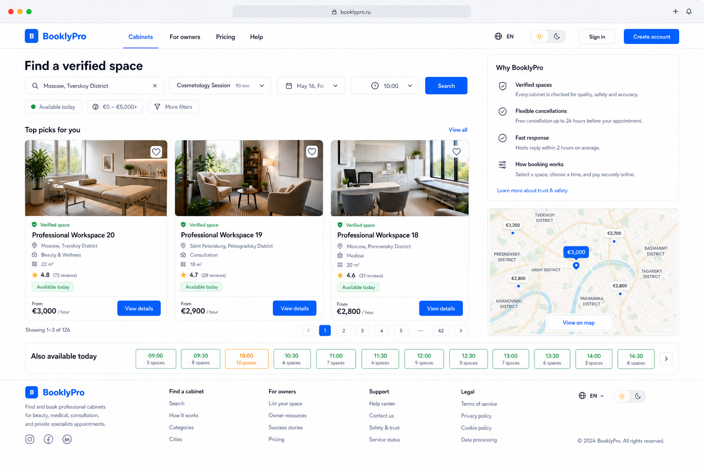

# AutoCare Hub homepage directions

These four desktop directions share the approved desktop baseline. The user
selected direction A on 2026-08-02. The map stays out of the homepage: it is
reserved for catalog map mode, cabinet context, and a confirmed booking route.

## A. Availability-first (selected)

Best for fast booking and continuity with the catalog: city, service, date,
time, and an availability rail are the first interaction.

The selected direction is expanded with a clear newcomer information layer, so
a visitor can understand the service before booking and quickly reach practical
guidance, rules, or support.

Required information architecture for the selected home route:

- one plain-language explanation that AutoCare Hub finds and books professional
  rooms by the hour for appointments, consultations, beauty, and private
  practice;
- search and availability remain the primary first action;
- visible paths for how booking works, choosing a space, listing a space,
  safety and verification, cancellation rules, and FAQ;
- short distinct client and owner journeys plus Help center and support entry;
- the shared header, footer, language, and light/dark theme controls remain
  available throughout the route.

## B. Map-first local discovery

Best where location and route planning are the dominant client need. The map,
nearby cards, price pins, and current-location action lead the page.

## C. Appointment-planner first

Best for returning clients who know their desired service and schedule. The
four-step planner creates an explicit appointment summary before results.

## D. Trust-first curated discovery

Best for first-time clients who need proof of quality before comparison. Real
photos, verification, ratings, cancellation rules, and available-today details
lead the decision.

All variants keep the approved header/footer, fake-browser deferral, map and
directions boundaries, and visible light/dark theme switching.
