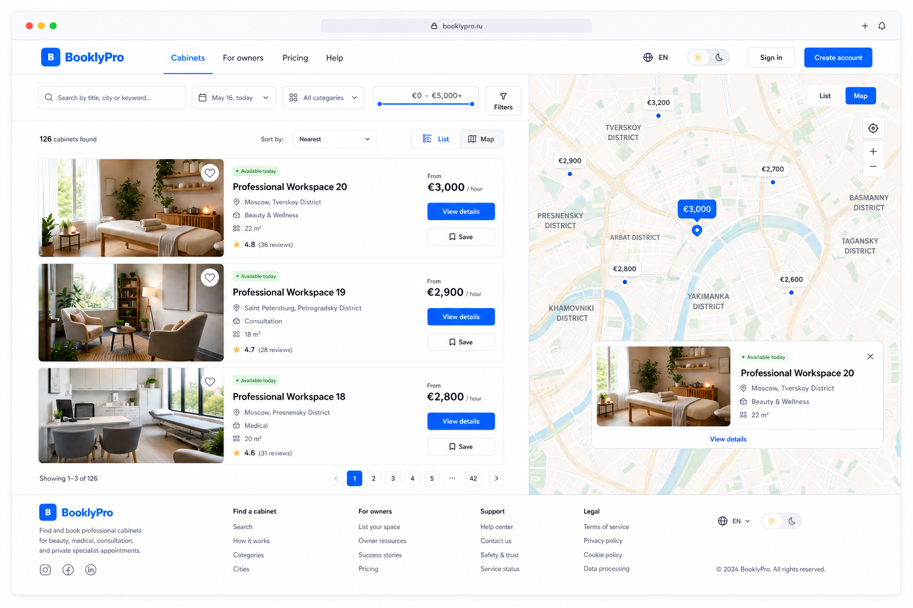
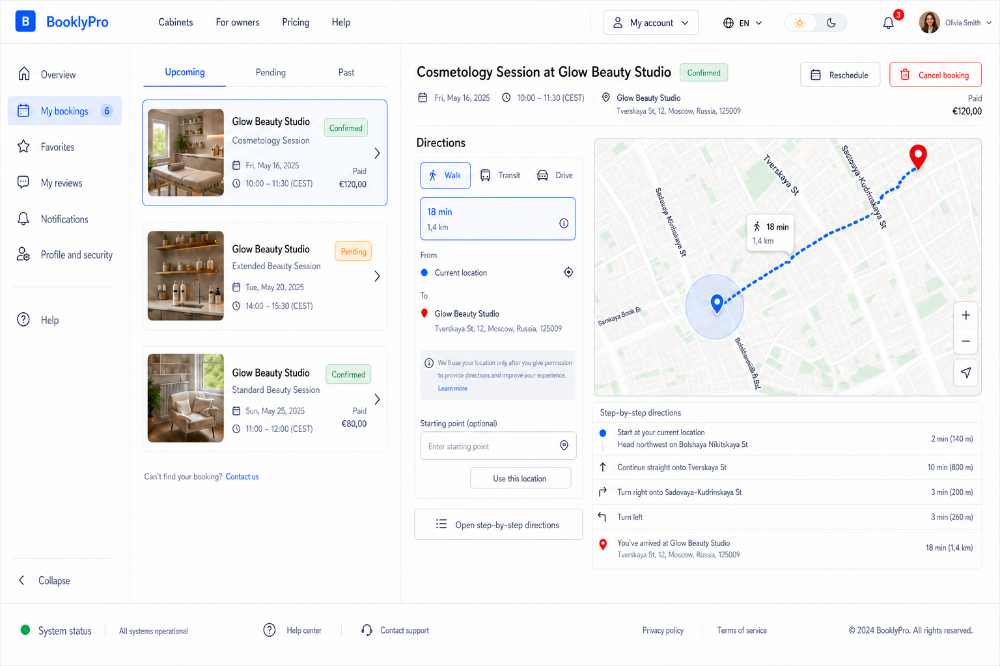
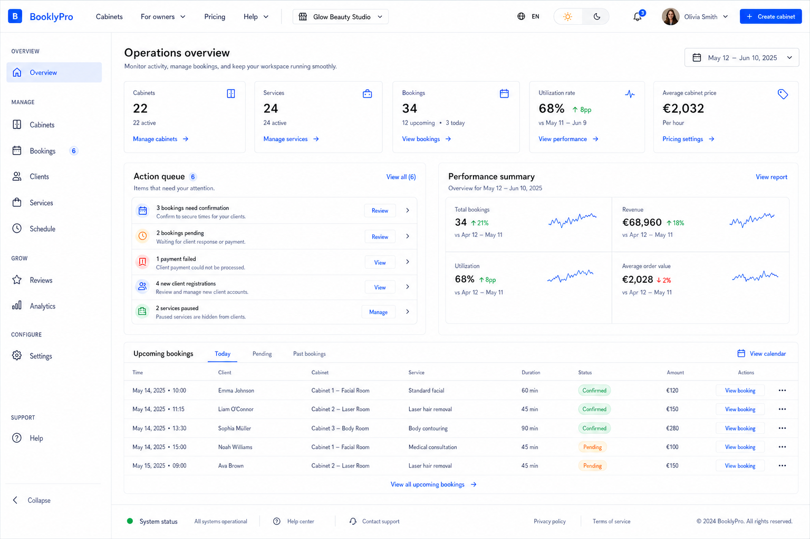
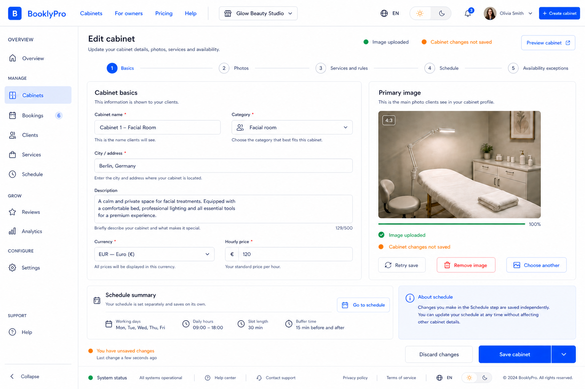
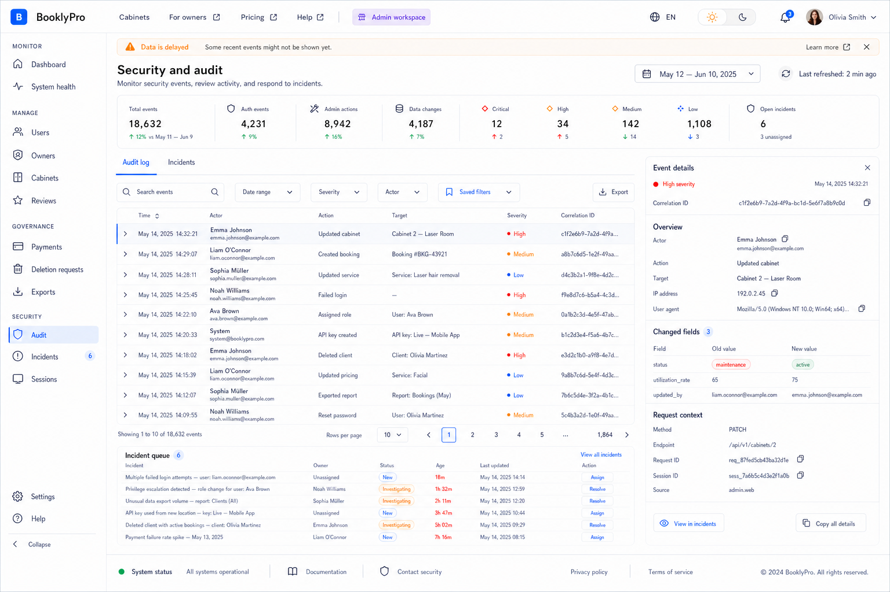

# AutoCare Hub desktop proposal suite, revision 3

Date: 2026-08-02

Status: approved desktop baseline. It revises revision 2 so every approved route
shares the same two-level navigation system before homepage directions are made.

## Shared navigation contract

Every desktop route has the same global header:

`AutoCare Hub | Cabinets | For owners | Pricing | Help | workspace/account | language | theme | notifications | profile`

Public pages use this header and the public footer directly. Authenticated pages
retain those same public links, then add a workspace/account switcher and a
contextual sidebar below the header. The sidebar is the scalable role-specific
navigation and has its own active state and collapse control.

This makes movement understandable:

- `Cabinets` opens public discovery and highlights Cabinets in the header.
- `For owners`, `Pricing`, and `Help` retain their public header destinations.
- An owner workspace opens the owner sidebar and highlights its current item.
- A client account opens the client sidebar and highlights its current item.
- An admin workspace opens the admin sidebar and highlights its current item.
- The header never needs to carry every role-specific destination.

The visible sun/moon control persists in the shared header. The footer contains
support, status, privacy, legal, language/theme access, and copyright; it does
not duplicate role navigation.

## Final desktop screens

### Catalog and map

### Cabinet detail and booking

### Cabinet reviews on the same route

### Client bookings and directions

### Owner dashboard

### Owner cabinet editor

### Admin audit workspace

## Approval boundary

These images are design evidence, not an implementation authorization. The user
approved the desktop baseline on 2026-08-02, recording design confirmation 2
of 3 for this concrete desktop route package. Final implementation still
requires a separate confirmation 3 of 3 after the homepage, tablet, and
PWA/mobile stages have been reviewed in their agreed order.
