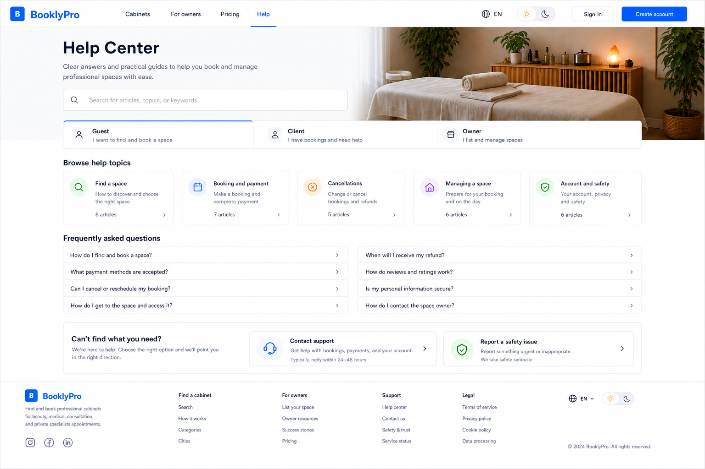
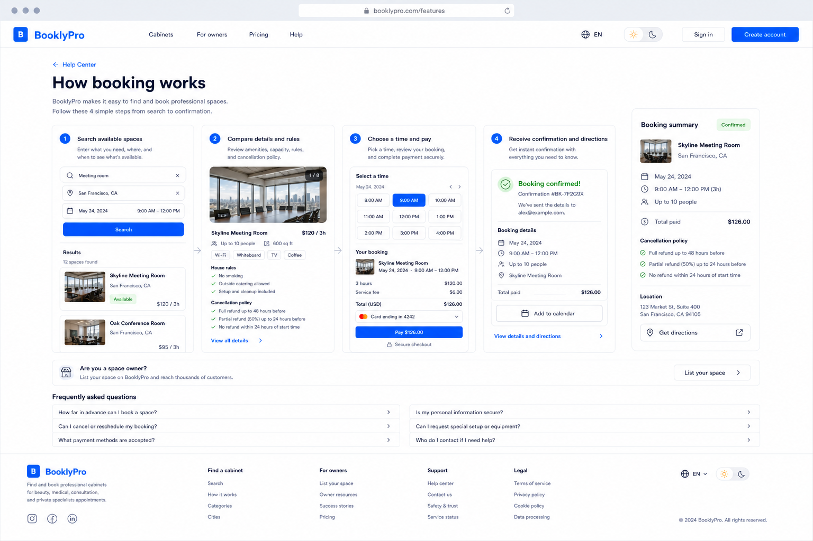
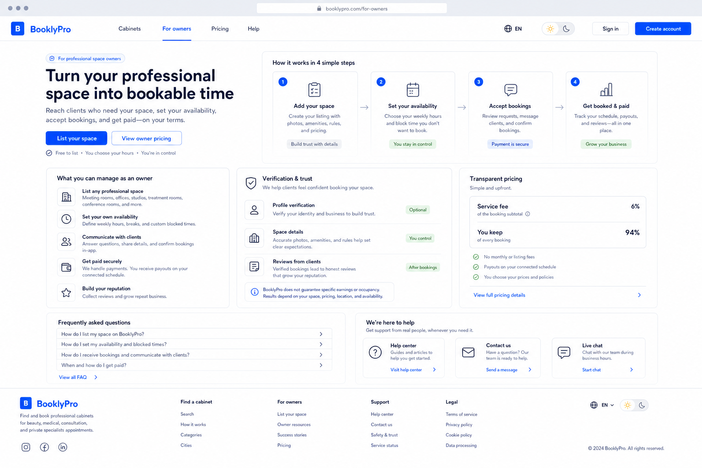
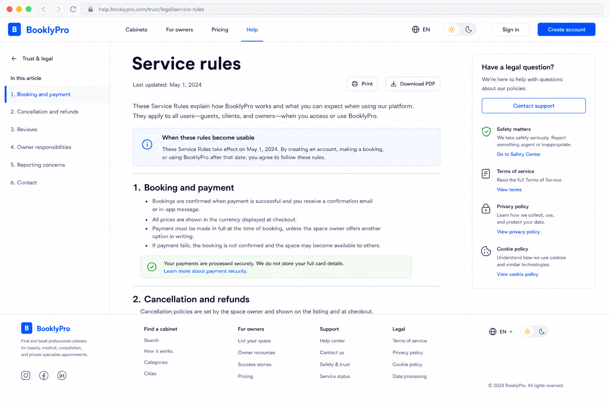
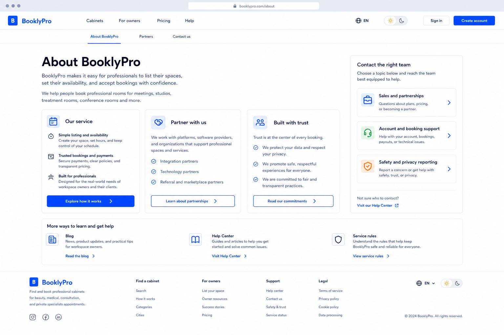
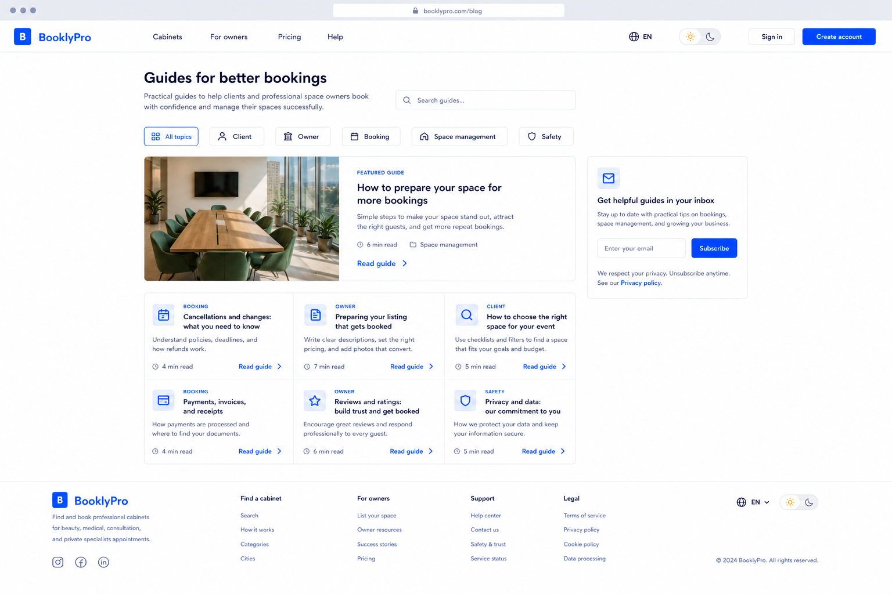

# AutoCare Hub footer-linked public page proposals

Date: 2026-08-03

Status: ready for user review. These are the page designs behind the useful
internal destinations already named in the footer. They extend the approved
desktop and tablet direction, but do not authorize visual implementation.

## Shared contract

- Every route keeps the public header, language control, visible light/dark
  switch, and full public footer.
- Footer links are internal routes, never `#` placeholders. Social, chat,
  telephone, and external contact links appear only after their actual approved
  destinations are available.
- Map is absent from all content pages. It remains limited to public catalog
  discovery, cabinet context, and confirmed booking directions.
- Reading pages use semantic headings, landmark navigation, a clear focus
  target after route changes, desktop/tablet/mobile reading widths, and a
  clear recovery path for loading, error, or no-result state.

## Help Center: `/help`

Search, role selection, topic categories, FAQ, normal support, and safety
reporting give a visitor a self-service path before an assisted path.

Implementation notes:

- Search must return real published articles or an honest empty state.
- Replace the illustrative response-time copy in the proposal with a published
  SLA, or omit it.
- Safety reports require a real protected workflow with acknowledgement and
  authorized access; they cannot be a decorative form.

## How booking works: `/features`

The client guide mirrors the actual booking sequence: search, compare rules,
choose a time and pay, then receive confirmation and directions.

Implementation notes:

- Directions appear only after a confirmed booking and location consent.
- Price, cancellation policy, availability, and payment wording must come from
  live listing and payment data, not static examples.

## For owners: `/for-owners`

The owner route explains listing, availability, bookings, payment, reviews,
pricing, verification, and help without claiming guaranteed revenue.

Implementation notes:

- The proposed live-chat card is conditional: render it only when a real
  staffed chat channel is enabled. Otherwise show Help Center and contact form.
- Service fees, payout timing, verification, and policy copy require business
  and legal approval before publication.

## Rules and privacy: `/rules`, `/privacy`

One readable legal template serves both documents: table of contents,
last-updated date, print/download action, scoped contacts, and related trust
links.

Implementation notes:

- Legal text, effective date, data-retention terms, and downloadable version
  must be supplied or approved by the organization.
- In-page links need stable IDs, accessible current-section state, and no
  invented legal guarantees.

## Company, partners, contacts: `/about`, `/partners`, `/contacts`

This route group shares a compact company-information frame while preserving
the visitor's selected task: understand the service, propose a partnership, or
contact sales, support, or privacy/safety staff.

Implementation notes:

- Each route gets its own title, canonical metadata, primary action, and
  focused content. The shared layout does not merge their content into one URL.
- Do not publish an address, social profile, contact channel, or customer claim
  until it is verified.

## Blog: `/blog`

The blog is a practical guide index with client/owner/task filters, readable
previews, article routes, and an optional consent-aware subscription form.

Implementation notes:

- Article body, authoring, moderation, publishing, search, and unsubscribe
  behavior need explicit product and data contracts before release.
- The subscription form requires a real consent record and privacy disclosure;
  otherwise it is omitted.

## Existing destinations

`/cabinets`, the category-prefilled services link, and `/pricing` already have
their own product routes. Their footer links remain part of the implementation
acceptance test matrix, even though they do not need a new page template here.

## Approval boundary

The user should approve this public-page suite before it becomes part of the
final implementation scope. PWA/mobile proposals remain the next responsive
stage. Visual code changes still require final confirmation 3 of 3.
