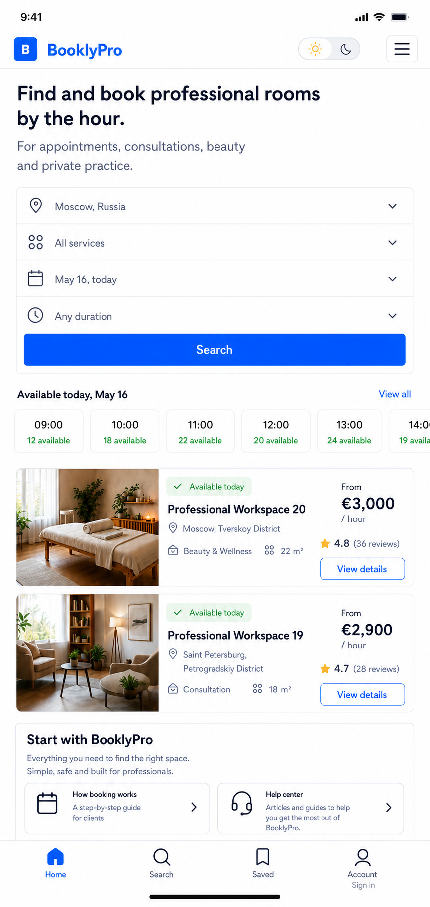
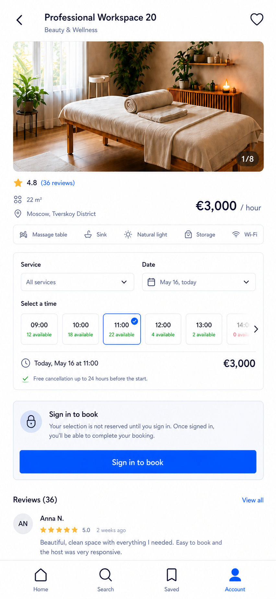
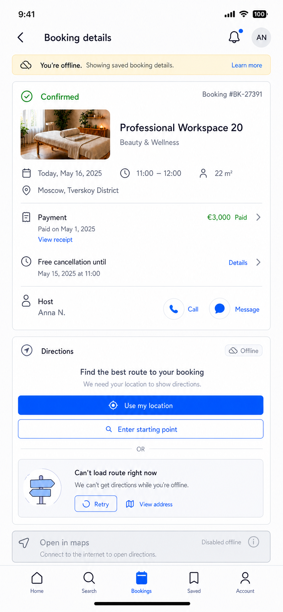
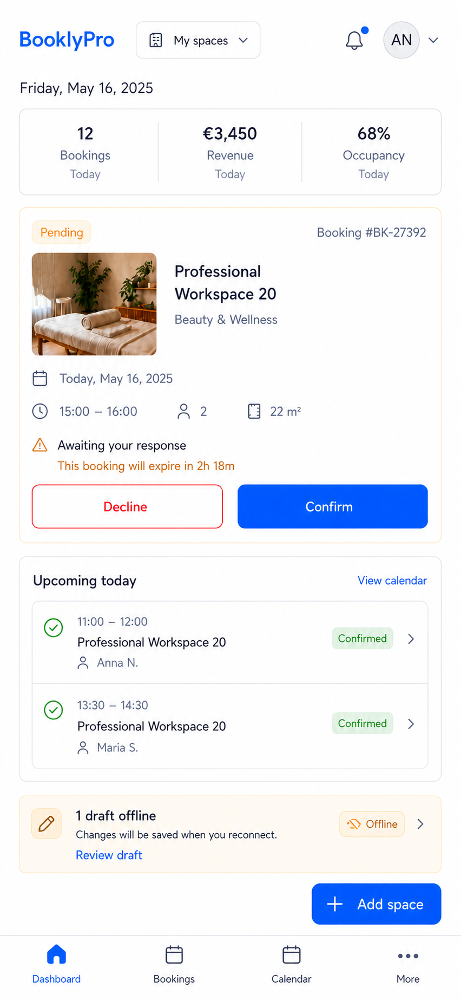
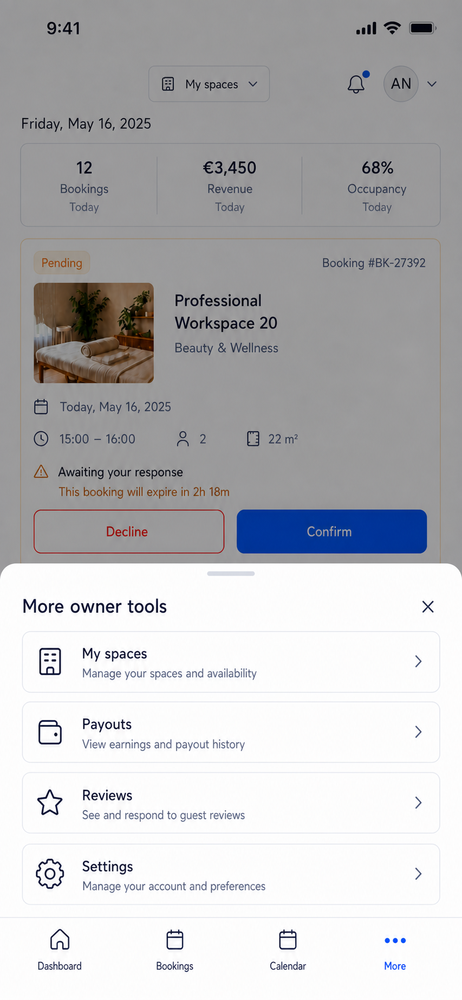
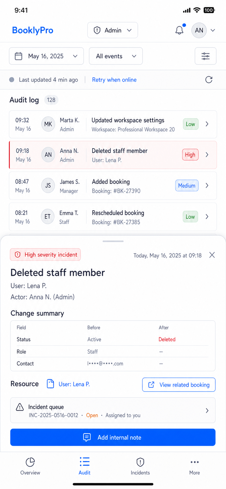

# AutoCare Hub PWA/mobile proposal suite

Date: 2026-08-03

Status: ready for user review. This completes the agreed responsive proposal
order: desktop, tablet, then standalone PWA/mobile. It does not authorize
visual implementation; final confirmation 3 of 3 remains required.

## Mobile navigation contract

- In installed standalone PWA mode, the system status bar replaces the
  desktop/tablet decorative browser framing. This is a platform-context rule,
  not the deferred production removal of that framing on wider web layouts.
- The public mobile header contains AutoCare Hub, an explicit theme switcher, and
  a menu that exposes Cabinets, For owners, Pricing, Help, language, and the
  appropriate authentication/account actions.
- Bottom navigation is role-aware and always sits above the system safe area.
  It never covers a sticky primary action or content.
- Client/owner/admin role navigation is mobile-native bottom navigation plus a
  `More` bottom sheet for lower-frequency destinations. No left sidebar is
  used on mobile.
- Footer routes remain available through public menu or role `More`; the
  browser-based compact footer may remain on long public pages, but the
  installed PWA must not duplicate it above bottom navigation.

## Guest home and discovery

The availability-first home explains AutoCare Hub, leads directly into city,
service, date, and duration search, then shows time availability, real result
continuity, How booking works, and Help Center.

Acceptance criteria:

- The homepage contains no map.
- The time rail is an explicitly scrollable, keyboard-operable horizontal
  control with a visible continuation affordance; the document itself never
  overflows horizontally.
- Guest Account presents an authentication boundary. Public menu exposes all
  agreed header and footer destinations.

## Guest cabinet and booking boundary

The guest can inspect photos, reviews on the same route, facilities, price,
rules, services, dates, and availability. They can select a proposed time but
that selection does not reserve the time.

Acceptance criteria:

- The only guest checkout action is `Sign in to book`; checkout is inaccessible
  until sign-in and no temporary hold is implied.
- Disabled slots state why they cannot be chosen. Price and cancellation terms
  are derived from live listing data.
- Directions do not appear until a booking is confirmed.

## Confirmed client booking, offline, and directions

A confirmed client retains saved booking details offline, including address,
payment receipt path, cancellation deadline, and host contact. A route needs
network plus location permission or a manually entered origin.

Acceptance criteria:

- Offline mode is explicit and never claims live data or queued booking
  mutations.
- `Use my location` has a manual-origin fallback. No route, denied permission,
  provider error, and offline states show an address/retry recovery path.
- `Open in maps` is disabled with a reason until a route is available.

## Owner workspace

The owner dashboard prioritizes pending confirmations, today's schedule, and
one protected local draft. It deliberately uses full-width content and bottom
navigation instead of the superseded mobile sidebar concept.

Acceptance criteria:

- The complete former sidebar is represented exactly once: Dashboard, Bookings,
  and Calendar are persistent bottom destinations; More opens a bottom sheet
  with My spaces, Payouts, Reviews, and Settings. The `More` sheet is labelled,
  dismissible, scroll-safe, and keeps the bottom navigation visible.
- The offline message applies only to an explicitly supported editable draft;
  booking confirmation/decline requires a server-confirmed mutation.
- `Add space` remains above the safe area and does not overlap navigation.

The prior sidebar exploration is retained only as an audit artifact in
`owner-dashboard-sidebar-superseded-mobile.png`; it is not part of the
candidate design.

## Admin audit and incident response

The admin view turns a wide audit table into compact event rows and a bottom
detail sheet. It exposes stale data honestly and masks sensitive metadata.

Acceptance criteria:

- Bottom navigation includes Overview, Audit, Incidents, and More; the role
  drawer is opened from More, not from a left rail.
- Filters, event details, incident links, and internal notes are keyboard and
  touch accessible at phone width.
- The interface never renders full IP addresses, tokens, raw user agents,
  private contact data, or other unauthorized audit metadata.
- Offline state offers retry without promising that incident notes or admin
  mutations were queued.

## Global PWA states

- Update prompts wait while a form is dirty or mutation is pending; dismissal,
  retry, and offline-ready states are localized and recoverable.
- Every state is tested in light/dark themes, RU/EN/RO, screen-reader and
  keyboard navigation, reduced motion, long text, empty/loading/error/stale
  data, and safe-area device sizes.
- Auth/account changes clear identity-scoped caches. Only explicitly public
  catalog GET data may be read from anonymous cache.

## Approval boundary

User approval of this PWA/mobile suite completes the visual proposal package.
Only then may the user provide confirmation 3 of 3 to authorize implementation
of the selected scope.
