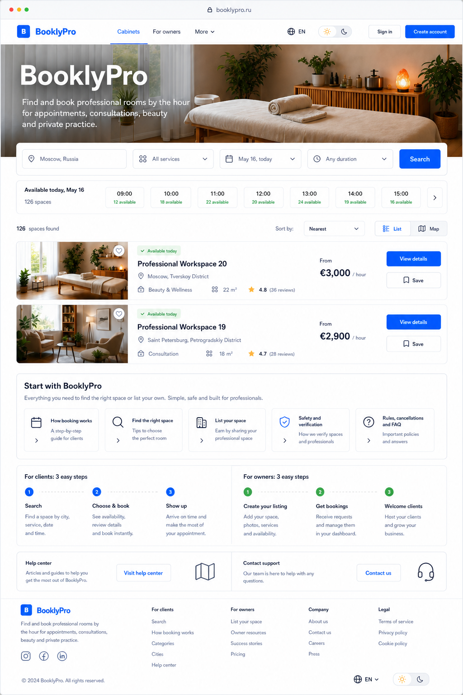
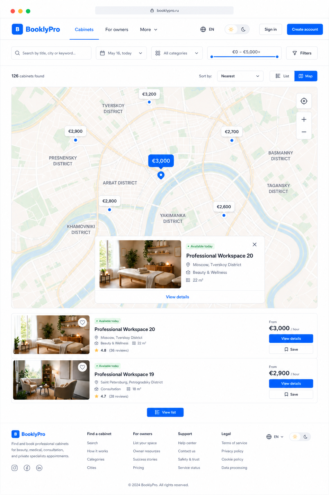
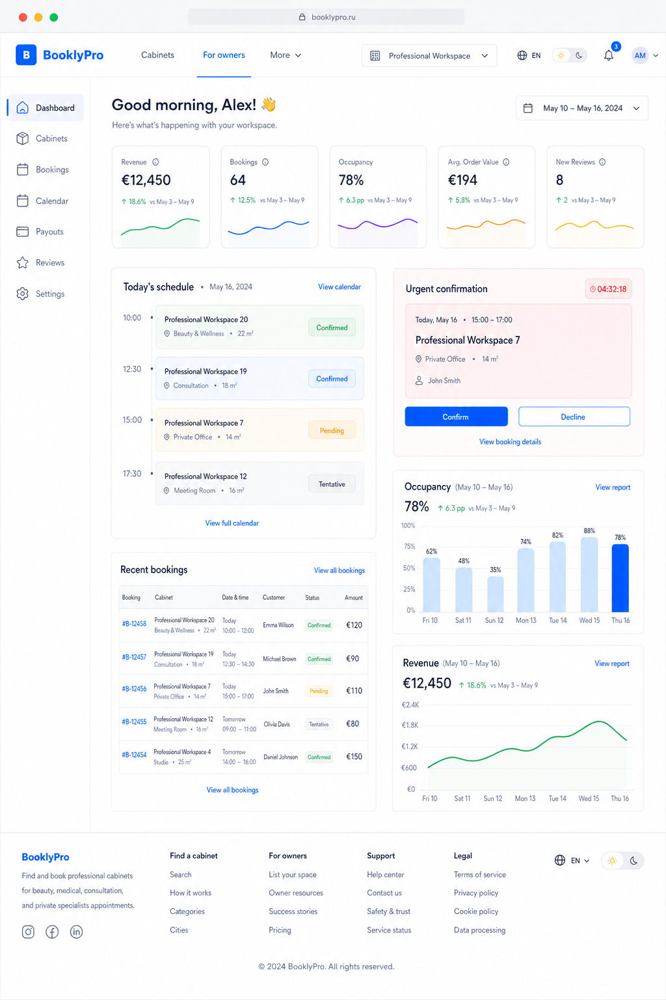
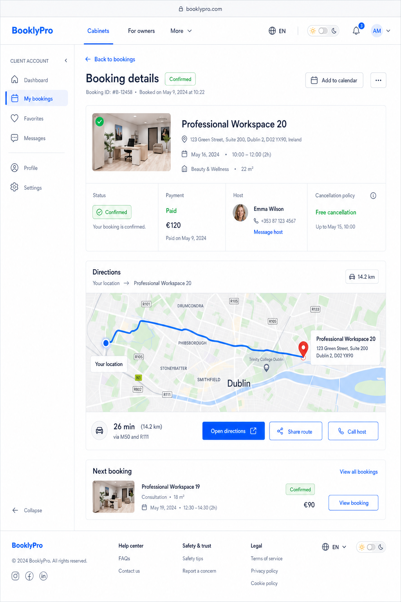
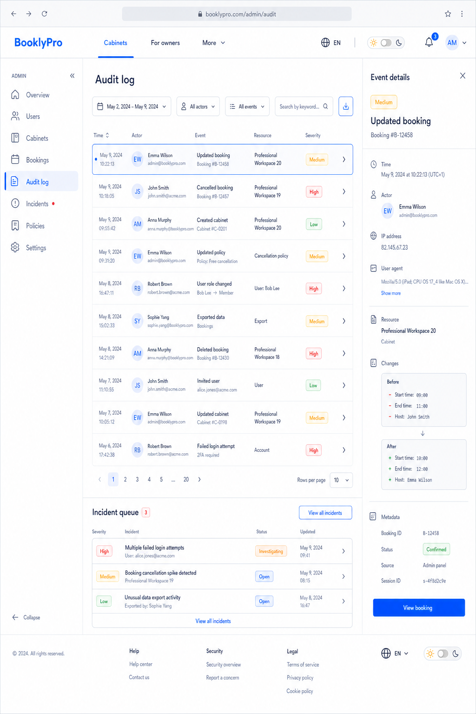

# AutoCare Hub tablet proposal suite

Date: 2026-08-03

Status: ready for user review. This suite continues the approved desktop
baseline and selected availability-first homepage direction. It is design
evidence only and does not authorize implementation.

## Shared tablet contract

- The global public header remains visible on every route. It contains
  AutoCare Hub, Services, For providers, and More for secondary public links, then
  language, visible light/dark theme control, and the appropriate account
  actions.
- Authenticated roles use a separate collapsible sidebar rail or drawer. It
  contains role-specific navigation; public header links do not disappear.
- Every 1024px portrait layout preserves useful task density, 44px-or-larger
  controls, no horizontal overflow, and a compact footer.
- A top-level public item is active only on its own public route. Deep role
  routes use the role-sidebar active state instead.
- The retained fake-browser framing is still a proposal-only visual choice;
  removing it remains deferred to the penultimate release action.

## Home: availability-first with practical orientation

The first screen explains AutoCare Hub, leads with service search and results,
then offers actionable guidance for clients and owners. Map discovery is not
shown here.

Acceptance criteria:

- A new guest can identify the service and reach search, help, safety, FAQ, or
  owner onboarding without sign-in.
- Provider results continue directly from search rather than becoming a detached
  marketing view.
- All public links, theme control, and footer paths stay reachable.

## Catalog: synchronized map discovery

The catalog keeps search filters, result count, List/Map mode, map controls,
selected-cabinet preview, result rows, and a return-to-list action in one
operable layout.

Acceptance criteria:

- List selection, map pin, preview card, map viewport, and URL filter state
  stay synchronized.
- Location permission is optional and has a manual city/address fallback.
- Map loading, denial, provider error, offline, and empty-result states remain
  recoverable and do not expose precise client location by default.

## Owner: operational dashboard

The owner route pairs the stable global header with a collapsible role sidebar.
Calendar, bookings, revenue, occupancy, reviews, and urgent confirmation
actions remain scannable in tablet density.

Acceptance criteria:

- The role sidebar can collapse to a labelled icon rail or open as a drawer.
- Urgent booking actions are clear and require confirmation where destructive.
- Tables and chart summaries have responsive alternatives, loading, empty, and
  stale-data states.

## Client: confirmed booking and directions

The client booking route retains a client sidebar while the public catalog link
remains visible in the header. Directions are a confirmed-booking capability,
with route, duration, host contact, and recovery actions.

Acceptance criteria:

- Directions require explicit location permission and provide manual origin,
  no-route, denied-permission, offline, and provider-error fallback states.
- The route is not displayed for an unconfirmed or cancelled booking.
- Payment, cancellation policy, host contact, and booking status are readable
  before navigation begins.

## Admin: audit and incident work

The audit list adapts to tablet width through a compact event table and details
panel instead of truncating privileged information. Incident work remains in
context.

Acceptance criteria:

- Filters, export, pagination, detail view, and incident navigation remain
  keyboard accessible and are not hidden by the side panel.
- Audit-event details do not expose more sensitive data than the authorized
  role can access.
- Empty, loading, error, and stale-data states preserve filters and offer a
  clear retry path.

## Review boundary

Approval of this tablet suite is the next design decision. After its approval,
the next proposal stage is PWA/mobile with safe areas, offline states, bottom
navigation, and touch ergonomics. Visual code changes still require the final
separate confirmation 3 of 3.
