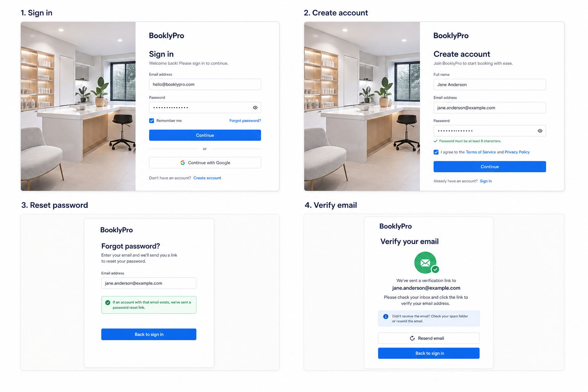
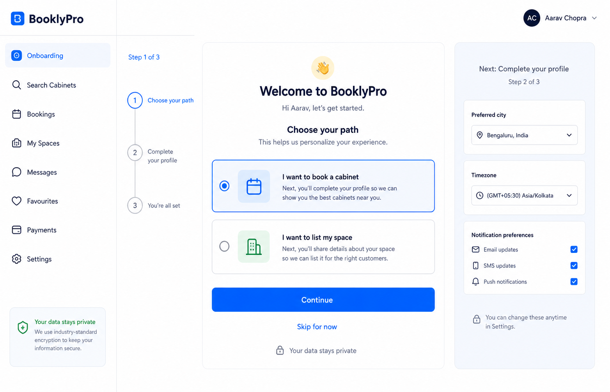
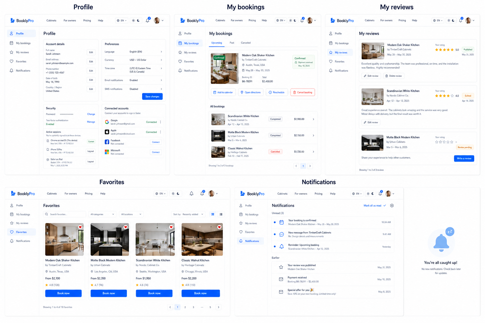
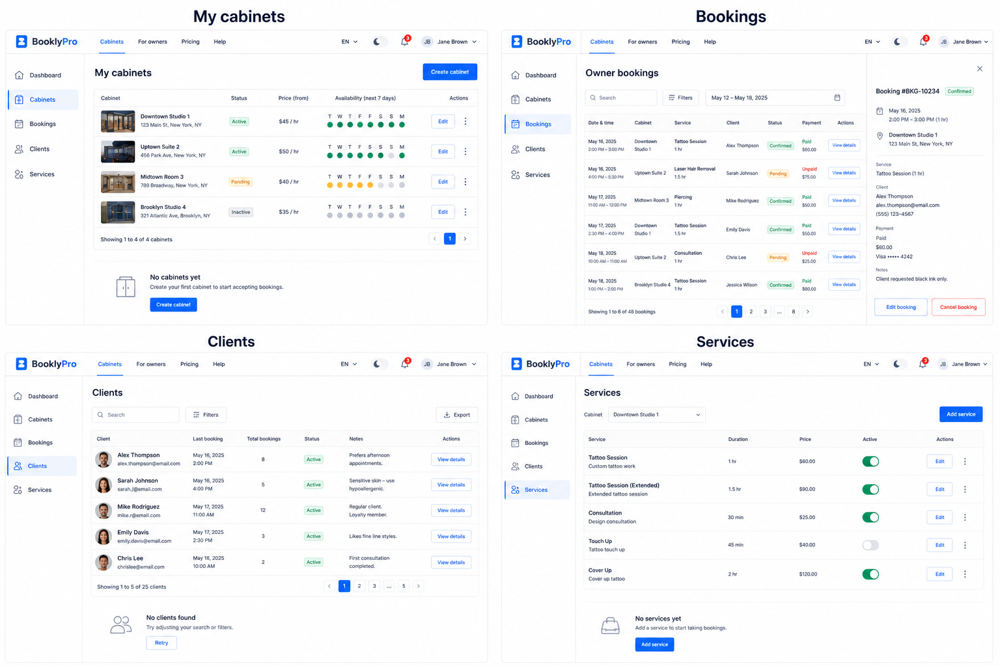
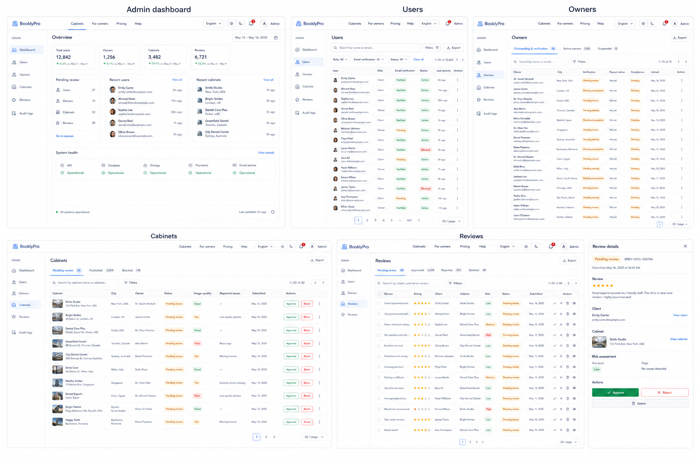
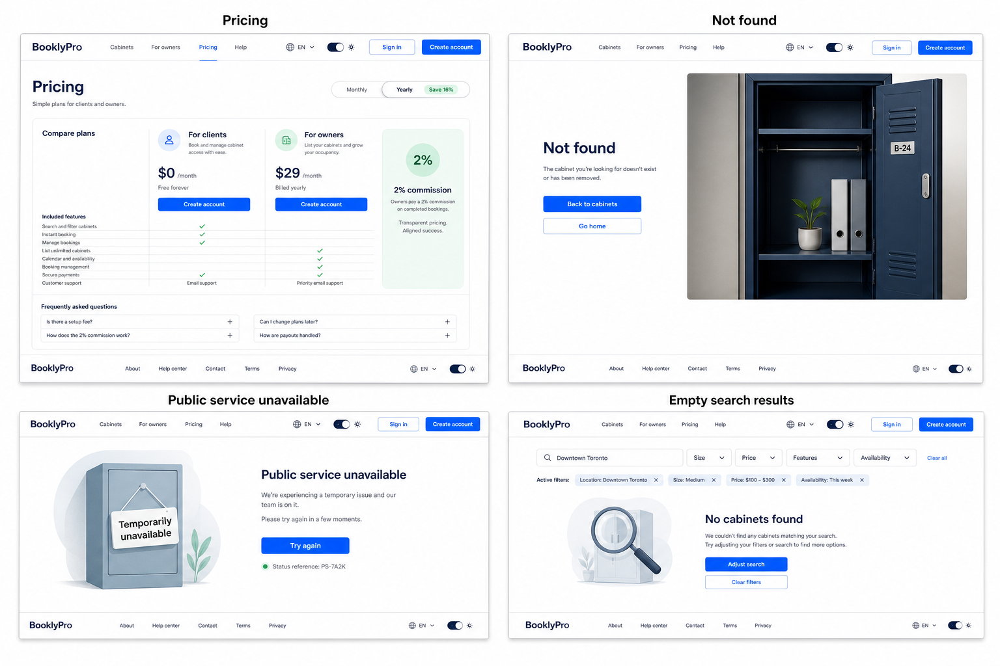

# AutoCare Hub missing-page desktop proposal suite

Date: 2026-08-04

Status: ready for user review. These images close the route-design gaps found
by comparing the current router with the approved desktop, tablet, mobile, and
footer design archives. They are design evidence only; they do not authorize
visual implementation.

Revision note: after review on 2026-08-04, the Client workspace, Owner
operations, and Admin management boards were regenerated to use the approved
white global header. No dark or black full-width headers are part of this
proposal suite.

## What was already covered

The following route families already have approved or archived design evidence:

- Homepage and public catalog/map.
- Cabinet detail, booking panel, cabinet reviews, and confirmed booking
  directions.
- Client bookings route.
- Owner dashboard and cabinet editor/create template.
- Admin audit workspace.
- Footer-linked public pages: how it works, for owners, help, rules, privacy,
  about/partners/contacts, and blog.

## New proposal groups

### A. Auth flow

Routes covered: `/login`, `/register`, `/forgot-password`, `/password/setup`,
`/password/reset`, `/verify-email`, and the loading/processing state of
`/login/callback`.

Design intent:

- Keep sign-in and registration as calm task screens with a shared cabinet
  image treatment and compact form hierarchy.
- Make password recovery and email verification explicit success/retry states,
  not dead-end messages.
- Keep password visibility, field errors, consent, resend, and return actions
  visible without introducing a second navigation system.

### B. Onboarding

Route covered: `/onboarding`.

Design intent:

- Make role selection the first decision: book a cabinet or list a space.
- Show progress through three steps and preview the next profile/preferences
  step without hiding the skip path.
- Keep privacy reassurance and later profile completion in the same flow.

### C. Client workspace

Routes covered: `/profile`, `/profile/bookings`, `/profile/reviews`,
`/favorites`, and `/notifications`.

Design intent:

- Use the persistent client sidebar already approved for the desktop shell.
- Give each route one dominant job: account settings, booking follow-up,
  review management, saved discovery, or notification triage.
- Keep operational actions close to the relevant row/card: calendar,
  directions, reschedule, cancel, edit review, book, mark read.
- Include empty, unread, stale, and connected-account states without turning
  them into modal-only experiences.

### D. Owner operations

Routes covered: `/owner/cabinets`, `/owner/bookings`, `/owner/clients`,
`/owner/services`, and the create state of `/owner/cabinets/create` using the
already proposed cabinet-editor template.

Design intent:

- Prioritize scan-friendly tables and repeated rows over decorative cards.
- Keep cabinet status, availability, payment, client history, and service
  activation visible at the decision point.
- Use detail drawers for booking/client context while preserving list filters
  and pagination.
- Provide honest no-cabinets, no-clients, and no-services recovery actions.

### E. Admin management

Routes covered: `/admin/dashboard`, `/admin/users`, `/admin/owners`,
`/admin/cabinets`, and `/admin/reviews`. `/admin/audit-logs` remains covered by
the approved audit design.

Design intent:

- Separate moderation queues from immutable audit history.
- Make verification, pending review, blocked, risk, and system-health states
  explicit but restrained.
- Keep filters, pagination, export, detail panels, and destructive actions
  accountable and easy to inspect.

### F. Pricing and recovery states

Routes/states covered: `/pricing`, the not-found route, public service
unavailable, and empty public catalog results.

Design intent:

- Explain client and owner pricing with a transparent 2% commission model and
  no unsupported guarantees.
- Make every recovery screen give one clear next action: back to cabinets, go
  home, try again, adjust search, or clear filters.
- Keep technical details out of user-facing errors while preserving a support
  reference for diagnostics.

## Approval boundary

Please approve or request changes by group:

- A: Auth flow
- B: Onboarding
- C: Client workspace
- D: Owner operations
- E: Admin management
- F: Pricing and recovery

After desktop approval, tablet and PWA/mobile variants will be derived in the
already agreed order. No production UI changes should start from these images
until the relevant group is approved.

## Source-of-truth notes

- The global header, footer, theme switch, role sidebar, typography direction,
  and density follow `docs/design/approved-desktop-baseline.md`.
- All proposal groups use the same light public/authenticated shell: white
  header, blue AutoCare Hub mark, dark text, pale active states, and blue action
  accents. Dark navy is reserved for text and small controls.
- These are generated bitmap proposals for discussion, not final copy or data.
- Real pricing, legal text, verification status, support channels, and system
  health values must come from approved product/backend contracts.
