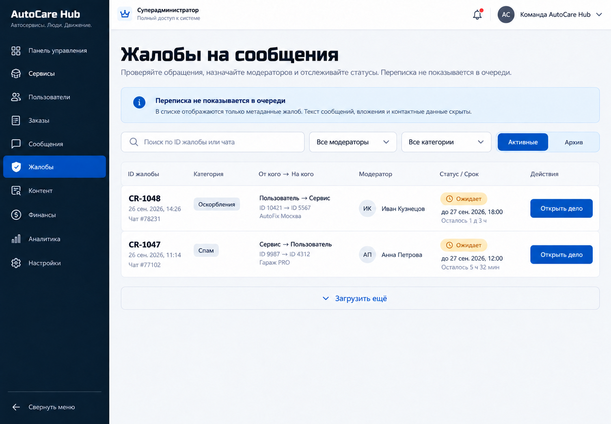
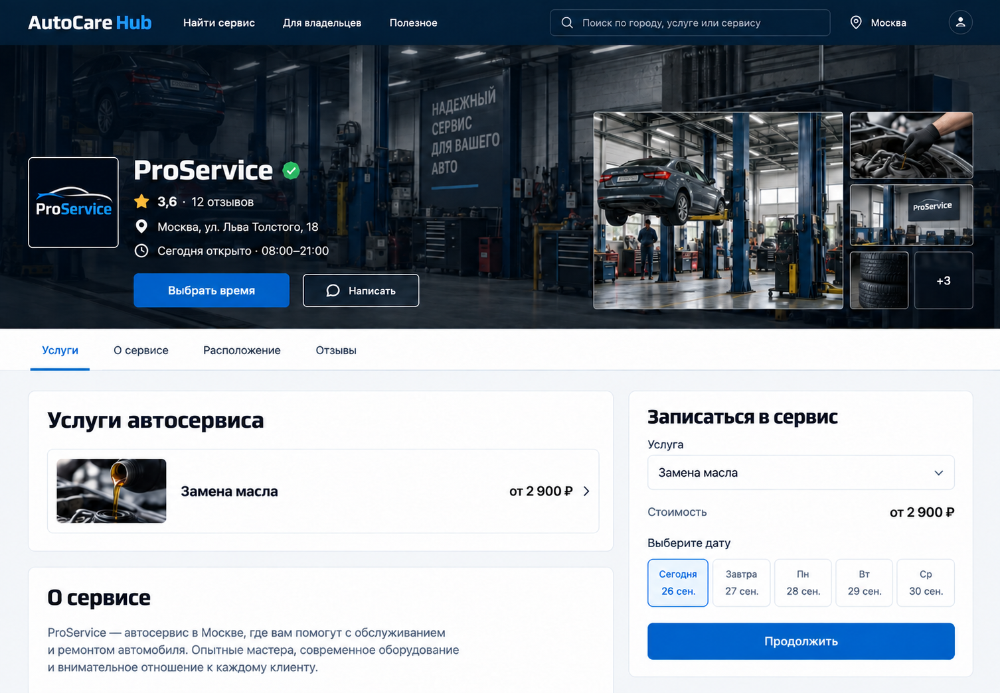

# Предложение по A21 и A29 — 26 сентября 2026

Предложение утверждено пользователем и реализовано. Макеты показывают предполагаемое состояние на широком экране; демонстрационные данные вымышлены.

## Результат

- **A21:** добавлены серверные фильтры и поиск для очереди модерации, курсорная история жалоб для клиента, состояния загрузки/ошибки и счётчики. Проверены фильтры очереди в браузере под ролью супер-администратора; границы доступа, фильтрация до пагинации и история клиента покрыты тестами.
- **A29:** публичный профиль, услуги и цены теперь присутствуют в первом HTML. Клиент получает тот же публичный DTO до гидратации; профильные метаданные остаются уникальными после неё. Проверены первый рендер, гидратация и узкий экран 390 px.
- После реализации прошли production-сборки Next.js и API, TypeScript, ESLint и целевые frontend/server-тесты.

## Что предлагается

### A21 — история и поиск жалоб

Для модерации: добавить поиск по ID жалобы или чата, переключение активных/закрытых жалоб и фильтр назначенного модератора. Фильтры применяются сервером до cursor-пагинации. Результат показывает участников, категорию, назначение и статус, но никогда не подставляет текст переписки. Для клиента в истории чата добавить переход к следующей странице собственных жалоб; доступ остаётся ограничен жалобами этого клиента.

[Точный wireframe A21 в SVG](./a21-report-queue.svg)

**Почему:** при большой очереди назначенное дело сложнее найти, а старые записи нельзя просмотреть. Фильтры и поиск сокращают ручной просмотр; отдельная кнопка продолжения делает полную историю доступной без загрузки всех жалоб сразу. Это подтверждённые ограничения из [аудита A21](../../../audits/PRODUCT_AUDIT_2026-09-25.md#L220).

**Приёмка:** доступны жалобы после первых 50/100; поиск и оба фильтра работают до пагинации; смена фильтра начинает новый cursor; пользователь получает только собственные жалобы; пустые, ошибочные, сетевые и permission-denied состояния понятны; список и счётчики не раскрывают сообщения.

### A29 — содержимое публичного профиля в первом HTML

Передавать с сервера тот же публичный профиль, который уже видит посетитель после загрузки страницы. Первый HTML содержит имя, адрес, часы, публичные услуги и цены, а клиентская гидратация продолжает работу с теми же данными и текущим порядком секций. Макет намеренно не добавляет видимые блоки и не меняет композицию существующей страницы.

[Точный wireframe A29 в SVG](./a29-public-profile.svg)

**Почему:** сейчас HTML-ответ клиентский, поэтому полезные сведения и H1 появляются после JS/API. Серверная публичная модель позволит читать профиль сразу и сформировать уникальный предпросмотр ссылки; в макете сохранены текущие hero, услуги и панель записи. Основание — [аудит A29](../../../audits/PRODUCT_AUDIT_2026-09-25.md#L292).

**Приёмка:** без JS исходный HTML содержит название, адрес/часы и опубликованные услуги/цены; неопубликованные, приостановленные или отсутствующие профили не раскрываются и получают корректный noindex/404; после гидратации нет вспышки скелетона или расхождения; две страницы имеют собственные метаданные.

## Общие состояния и границы

| Состояние / контекст | A21 | A29 |
| --- | --- | --- |
| Телефон / узкий экран | Поиск занимает ширину, фильтры переносятся; жалобы становятся карточками, действия доступны без горизонтальной прокрутки. | Сохраняется существующее адаптивное поведение: hero сверху, затем услуги/сведения и панель записи в текущем порядке. |
| Светлая / тёмная тема | Используются текущие поверхности, границы, семантические статусы и синий primary; контраст остаётся доступным. | Используется существующая тёмная hero-поверхность и текущие карточки темы. |
| Локализация | Все названия, пустые/ошибочные состояния, даты и количество результатов локализованы для RU/EN; поиск ID locale-независим. | Сервер выбирает язык из текущего запроса; title/description и видимые подписи локализованы, цена/дата форматируются по текущей локали. |
| Загрузка / ошибка / офлайн | Скелетон повторяет фильтры и карточки; ошибка даёт повтор; офлайн сохраняет уже показанное как устаревшее и не выдаёт новые результаты за актуальные. | Начальный HTML остаётся читаемым; API-ошибка не превращает профиль в 404. Доступные кешированные публичные данные помечаются согласно текущему состоянию UI. |
| Пусто / доступ запрещён | Пустой поиск предлагает очистить фильтры; клиент без своих жалоб видит нейтральное пустое состояние. Запросы пользователя ограничены серверной авторизацией; модератор без назначения не получает переписку. | Профиль без опубликованной публичной модели не отдаёт скрытые сведения; неизвестный/закрытый ID — 404/noindex. |
| Движение / фокус | Не нужна новая анимация; видимый focus, клавиатурный доступ и крупные цели управления сохраняются. | Без новой анимации; семантические заголовки и ссылки остаются в исходном HTML. |

## Затрагиваемые границы

- A21: список жалоб, параметры API/репозитория, cursor и переводимые подписи; без расширения прав чтения переписки и без текста сообщений в очереди.
- A29: только публичная DTO-модель, сериализация страницы Next и согласованная гидратация; никаких email, телефонов, документов или внутренних полей, если они не опубликованы текущей публичной моделью.
- Токены остаются существующими из `src/index.css`: `--background`, `--card`, `--foreground`, `--primary`, `--border`, `--radius-control/card/panel`, `--font-display` (Russo One) и `--font-body` (Onest).
- По `AGENTS.md` нужны три независимых подтверждения: (1) можно менять дизайн; (2) утверждён конкретный визуальный scope A21 и A29; (3) после просмотра этого предложения разрешено внедрить этот scope. До них макеты остаются только предложением.
